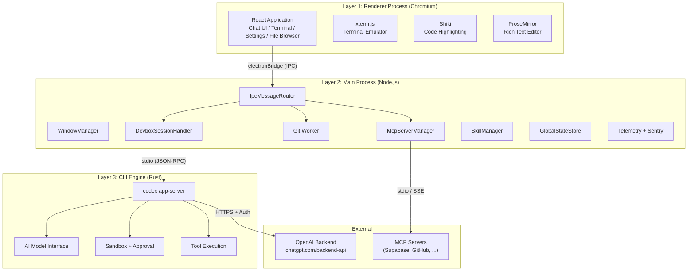
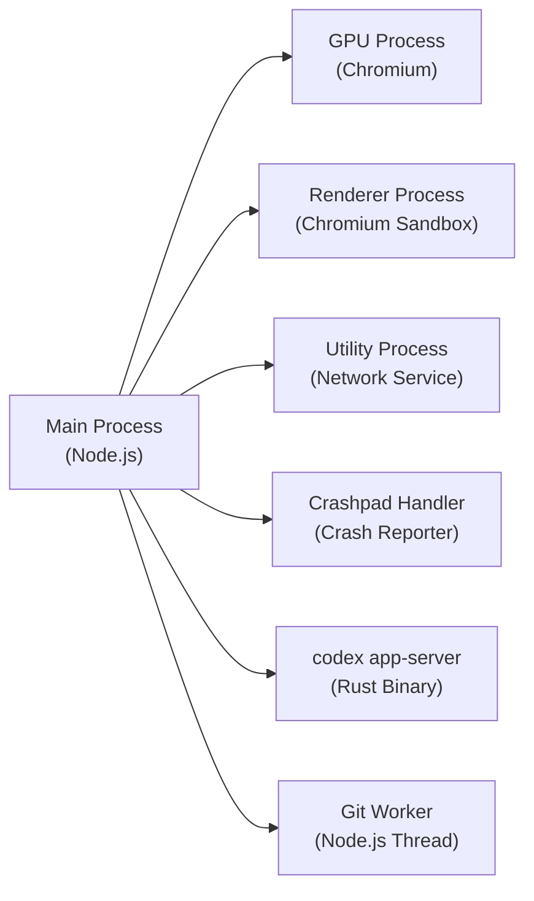
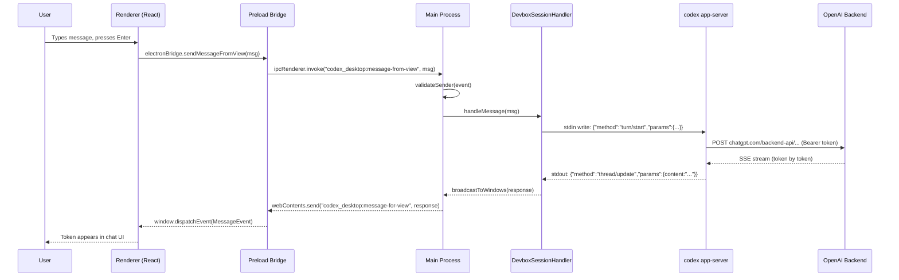
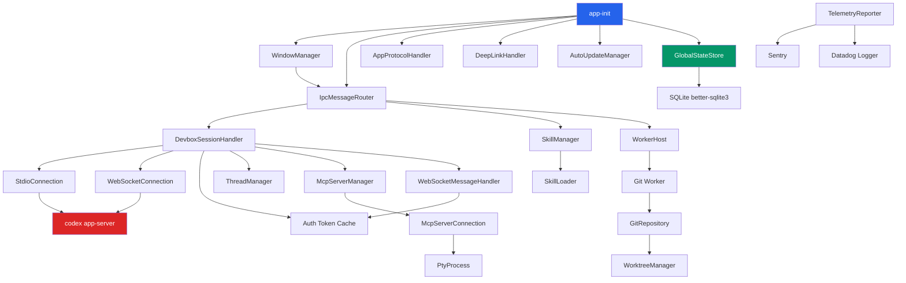

# 01 -- Architecture Overview

> The Codex Desktop Application is a three-layer system: a React frontend rendered inside Chromium, an Electron main process that orchestrates everything, and a Rust CLI binary that serves as the AI engine. This document maps out the full architecture.

---

## The Three Layers

The application follows a strict separation of concerns across three distinct runtime environments. Each layer runs in its own operating system process and communicates through well-defined interfaces.

---

## Process Model

Every running Codex instance consists of multiple operating system processes. Electron spawns several by design, and Codex adds its own.

| Process | Runtime | Role |
|---------|---------|------|
| Main | Node.js (Electron) | Orchestration hub -- manages windows, IPC, state, system integration |
| Renderer | Chromium (sandboxed) | Renders the React UI, handles user interaction |
| GPU | Chromium | Hardware-accelerated rendering, compositing |
| Utility | Chromium | Network service, handles HTTP at the OS level |
| Crashpad | Native | Collects crash reports and ships them to Sentry |
| codex app-server | Rust | AI engine -- model communication, tool execution, thread management |
| Git Worker | Node.js Worker Thread | Background git operations to avoid blocking the main thread |

---

## Data Flow: From User Input to AI Response

When a user types a message and hits Enter, the data traverses all three layers, reaches the OpenAI backend, and streams back through the same path.

The key insight is that the Main Process never talks to OpenAI directly. It delegates everything to the CLI binary, which owns the HTTP connection, authentication state, and streaming logic. The Main Process is purely an orchestrator.

---

## Technology Decisions

### Why Electron?

Electron provides three things that are hard to get elsewhere: a mature cross-platform windowing system, access to native APIs (file system, notifications, tray, auto-update), and the ability to embed a full browser engine for the UI. The trade-off is memory consumption, but for a developer tool that runs alongside an IDE, this is acceptable.

### Why a Rust CLI as the Backend?

The CLI binary (`codex-rs`) handles everything that touches the AI model: prompt construction, token streaming, tool execution, sandbox enforcement, and conversation persistence. Writing this in Rust gives three advantages:

1. **Performance** -- Streaming SSE parsing, JSON serialization, and file system operations are significantly faster than Node.js equivalents.
2. **Shared codebase** -- The same binary runs as a standalone terminal tool (`codex` in TUI mode) and as the backend for the desktop app (`codex app-server` mode). Users get identical AI behavior in both.
3. **Safety** -- Rust's ownership model prevents entire categories of bugs in the sandbox and file system layers.

### Why stdio Instead of WebSocket for CLI Communication?

The stdio transport (stdin/stdout) was chosen over WebSocket or HTTP because:

- No port allocation needed -- avoids conflicts on the developer's machine.
- Process lifecycle is tied to the parent -- if Electron crashes, the CLI process receives SIGPIPE and exits cleanly.
- Lower latency than localhost TCP for high-frequency message passing.
- Simpler security model -- no network surface to attack.

A WebSocket transport exists as an alternative for remote environments (devbox, SSH), but stdio is the default for local development.

### Why React + Vite?

The renderer uses React for its component model and Vite for fast bundling. The entire UI compiles into a single JavaScript bundle (~6.5 MB minified) plus a CSS bundle (~300 KB). Vite's module system allows code-splitting for heavy dependencies like language grammars (Shiki loads 430+ grammar files on demand).

---

## Module Dependency Graph

The Main Process consists of 39 modules. This graph shows the primary dependency relationships.

---

## Communication Protocols Summary

| Path | Protocol | Format | Direction |
|------|----------|--------|-----------|
| Renderer <-> Main | Electron IPC | Structured objects | Bidirectional |
| Main <-> CLI | stdio | JSON Lines (NDJSON) | Bidirectional |
| Main <-> CLI (remote) | WebSocket | JSON frames | Bidirectional |
| CLI <-> OpenAI | HTTPS | JSON + SSE streaming | Request/Response |
| Main <-> MCP Servers | stdio / SSE | JSON-RPC 2.0 | Bidirectional |
| Main <-> Git Worker | MessagePort | Structured objects | Bidirectional |
| Renderer <-> Git Worker | IPC (proxied) | Structured objects | Bidirectional |

---

## What the User Sees vs. What Happens

| User Action | Layer 1 (Renderer) | Layer 2 (Main) | Layer 3 (CLI) |
|-------------|-------------------|----------------|---------------|
| Opens app | -- | Creates BrowserWindow, loads `app://-/index.html` | Spawned as `codex app-server` |
| Types a message | ProseMirror captures input | -- | -- |
| Sends message | Dispatches via `electronBridge` | Routes through IPC to DevboxSession | Sends to OpenAI, streams back |
| Sees AI typing | Renders streaming tokens | Forwards CLI events to renderer | Parses SSE stream from API |
| AI runs a command | Shows terminal output (xterm.js) | Creates PTY session | Executes in sandbox |
| Opens a file | Renders file content | Reads from filesystem | -- |
| Changes settings | Settings UI updates | Writes to GlobalStateStore | Reads config on next request |
| Receives notification | Shows toast | Triggers native notification | Emits event |

---

## Next Document

Continue to [02 -- Electron Lifecycle](02-electron-lifecycle.md) for a deep dive into the application startup sequence, ready state machine, and shutdown behavior.
