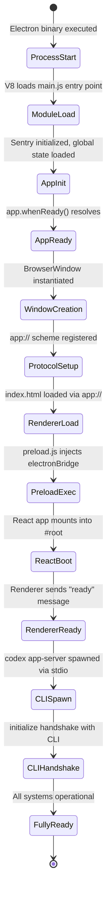
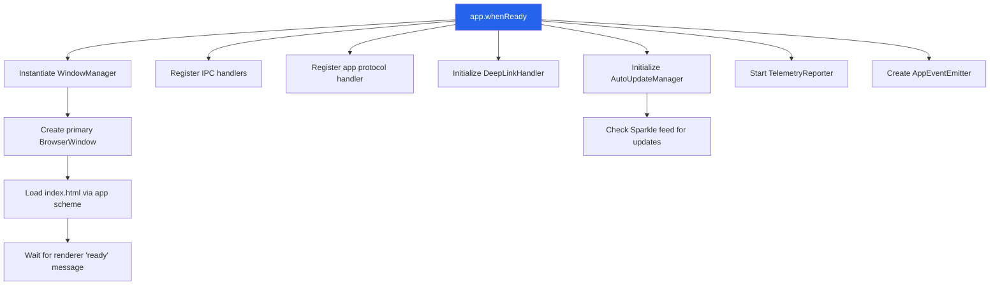
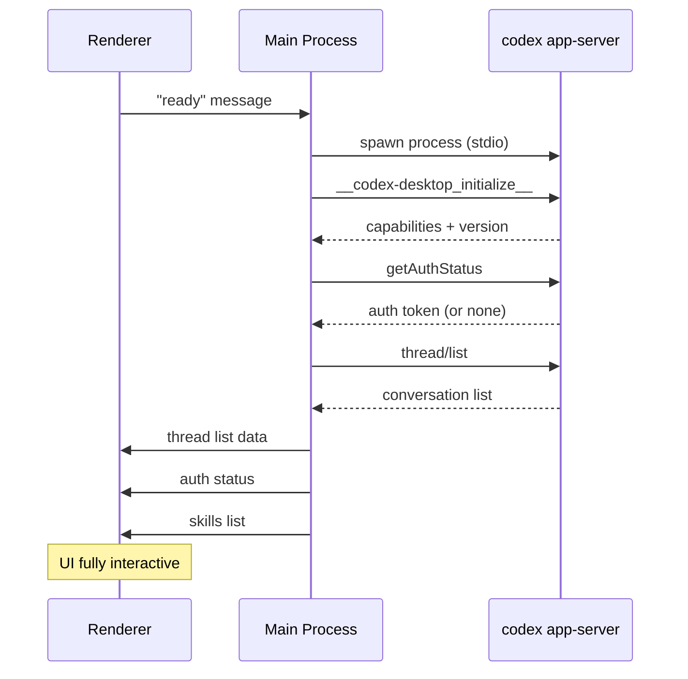

# 02 -- Electron Lifecycle

> The application's startup sequence is a carefully orchestrated dance between Electron APIs, window creation, CLI process spawning, and renderer readiness. Understanding this sequence is critical for debugging timing issues and race conditions.

---

## Boot Sequence

The application moves through distinct phases between launch and user interaction readiness.

---

## Phase 1: Process Start and Module Load

When the operating system launches the Electron binary, Node.js loads the entry point defined in `package.json` (`main: ".vite/build/main.js"`). This small file imports the actual main process code from `main-SuCoSan9.js`, which is a single monolithic bundle containing all 39 modules.

During this phase:
- The V8 engine initializes and compiles the JavaScript.
- All top-level module code executes (class definitions, constant declarations, import resolution).
- Sentry error tracking attaches to the process as early as possible to capture any bootstrap failures.

---

## Phase 2: App Initialization (Before Ready)

Before Electron's `app.whenReady()` resolves, the application performs pre-ready setup:

1. **Global State Store** -- Reads `~/.codex/.codex-global-state.json` into memory. This file contains persistent key-value pairs (window bounds, user preferences, host configurations).

2. **Protocol Registration** -- The `app://` custom URL scheme is registered as a privileged scheme with `standard`, `secure`, and `supportFetchAPI` flags. This must happen before `app.whenReady()` because Chromium locks scheme registration after that point.

3. **Single Instance Lock** -- The app requests a single-instance lock. If another Codex instance is already running, the new instance forwards its command-line arguments to the existing one and exits.

4. **Deep Link Queue** -- Any `codex://` URLs that triggered the launch are queued for processing after the renderer is ready.

---

## Phase 3: App Ready

Once Chromium has finished initializing, `app.whenReady()` resolves and the main initialization begins.

The **WindowManager** is the first critical object instantiated. It owns the lifecycle of all BrowserWindow instances and provides the messaging layer to reach renderers.

The **IPC handlers** are registered next. Every `ipcMain.handle()` and `ipcMain.on()` call happens here, establishing the full API surface between the renderer and the main process.

The **AutoUpdateManager** initializes the Sparkle framework (macOS native auto-updater). It loads the `sparkle.node` native addon and points it at the appcast XML feed. If Sparkle fails to load (common in development builds), the error is logged but does not block startup.

---

## Phase 4: Window Creation and Renderer Boot

The primary window is created with specific Electron configuration:

- **Title bar style:** `hiddenInset` on macOS -- the traffic lights (close/minimize/maximize) are inset into the content area, and the app provides its own toolbar.
- **Vibrancy:** `under-window` -- macOS translucency effect where the desktop background blurs through the window.
- **Background color:** Transparent (`#00000000`) to support the vibrancy effect.
- **Context isolation:** Enabled -- the renderer cannot access Node.js APIs.
- **Node integration:** Disabled -- an additional layer of security.
- **Sandbox:** Enabled -- the renderer runs in Chromium's sandbox.

The window loads `app://-/index.html`, which is resolved by the custom protocol handler to the `webview/index.html` file inside the asar archive.

---

## Phase 5: Preload and React Bootstrap

When the renderer starts loading, Electron injects the preload script before any page JavaScript executes. The preload script:

1. Sets `window.codexWindowType = "electron"` so the React app knows it is running inside Electron (as opposed to a browser extension or web context).

2. Exposes the `window.electronBridge` object via `contextBridge.exposeInMainWorld()`. This is the only way the renderer can communicate with the main process.

3. Caches synchronous IPC results (`getSentryInitOptions`, `getBuildFlavor`) that the renderer needs immediately during boot.

4. Registers a listener on `codex_desktop:message-for-view` that converts incoming IPC messages into standard `MessageEvent` objects dispatched on `window`.

After the preload executes, the React application boots. The Vite-bundled JavaScript loads, React mounts into the `#root` div, and the application shell renders.

---

## Phase 6: Renderer Ready and CLI Spawn

Once the React application has finished its initial render and is ready to receive data, it sends a `"ready"` message through the IPC bridge. This is the signal for the main process to:

1. **Spawn the CLI process** -- The main process locates the `codex` binary and spawns it with `child_process.spawn("codex", ["app-server", "--analytics-default-enabled"])`. Communication happens over stdin/stdout.

2. **Perform the initialization handshake** -- A special `__codex-desktop_initialize__` request is sent to the CLI. The CLI responds with its capabilities and version.

3. **Request authentication status** -- A `getAuthStatus` method call retrieves any cached auth tokens from the CLI's credential store.

4. **Load thread list** -- The CLI reads from its SQLite database and returns the user's conversation history.

5. **Process pending deep links** -- Any `codex://` URLs that were queued during startup are now processed and routed to the appropriate UI location.

6. **Initialize Skills** -- The SkillManager loads skills from `~/.codex/skills/` and sends the list to the renderer.

---

## Shutdown Behavior

### Graceful Shutdown

When the user closes the last window or quits via Cmd+Q:

1. The WindowManager persists window bounds to the GlobalStateStore.
2. The GlobalStateStore flushes its in-memory state to disk (`~/.codex/.codex-global-state.json`).
3. The main process sends a termination signal to the CLI process (SIGTERM).
4. The CLI process flushes any pending database writes and exits.
5. Electron's `app.quit()` is called, which tears down all remaining processes.

### Crash Recovery

If the renderer process crashes:
- Electron detects the crash via `webContents.on('render-process-gone')`.
- The main process logs the crash to Sentry.
- A new renderer is created and the window reloads.
- The CLI process continues running -- it is independent of the renderer.

If the CLI process crashes:
- The StdioConnection detects the broken pipe.
- The DevboxSessionHandler attempts to restart the CLI with exponential backoff.
- The renderer is notified of the temporary disconnection.
- Pending requests are either retried or rejected with an error.

If the main process crashes:
- All child processes receive SIGPIPE and exit.
- The Crashpad handler captures the crash report and submits it to Sentry on the next launch.

---

## Timing Considerations

The bootstrap sequence has several ordering constraints:

| Must happen before... | ...this can happen |
|----------------------|-------------------|
| `app.whenReady()` | Any BrowserWindow creation |
| Protocol scheme registration | `app.whenReady()` |
| IPC handler registration | Renderer sends first message |
| Renderer "ready" message | CLI process spawn |
| CLI initialization handshake | Any thread/turn operations |
| Auth token retrieval | Any API-bound requests |

Violating these constraints causes silent failures or race conditions. The application uses a combination of promises, event listeners, and explicit ready flags to enforce the ordering.

---

## Next Document

Continue to [03 -- Main Process Modules](03-main-process-modules.md) for a detailed breakdown of every module in the main process.
