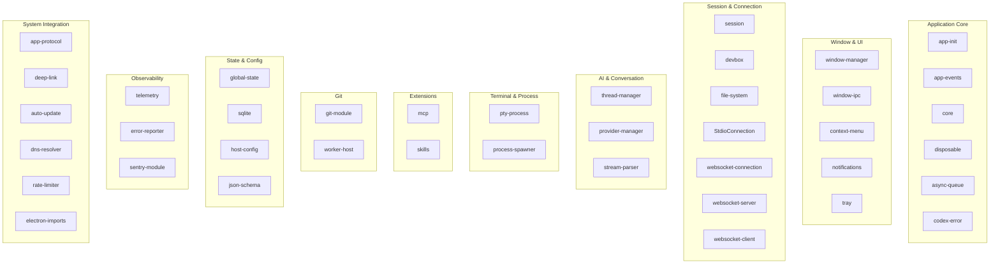

# 03 -- Main Process Modules

> The main process is composed of 39 discrete modules, each responsible for a well-scoped concern. This document catalogs every module, describes its role, and maps the dependency relationships.

---

## Module Organization

The modules live under `src/main/modules/` and are organized by domain. Some modules are standalone files, others are grouped into subdirectories.

---

## Module Catalog

### Application Core

#### `app-init`
The bootstrap module. It does not define a class -- it is procedural initialization code that runs once during startup. It wires together the WindowManager, IPC handlers, protocol handlers, and deep link manager. Think of it as the `main()` function of the application.

#### `app-events` -- AppEventEmitter
A simple publish-subscribe event bus scoped to the application lifecycle. Emits three events: `foreground` (app gains focus), `background` (app loses focus), and `turnComplete` (an AI turn finishes). Other modules subscribe to these events to trigger side effects like pausing telemetry when the app is in the background.

#### `core`
Shared utility functions used across the codebase. Contains helpers for path resolution, platform detection, environment variable reading, and common string operations. This is the "junk drawer" module -- anything that does not fit elsewhere ends up here.

#### `disposable` -- DisposableCollection
Implements the disposable pattern for resource cleanup. Modules create disposable collections, register cleanup functions, and call `dispose()` when they are done. This prevents resource leaks in long-running processes (file watchers, event listeners, timers).

#### `async-queue` -- AsyncQueue
A serialized promise queue that ensures asynchronous operations execute one at a time. Used in places where concurrent access to a shared resource would cause corruption (such as writing to the global state file).

#### `codex-error` -- CodexError
Custom error classes with structured error codes. Provides a consistent error hierarchy that the IPC layer can serialize and transmit between processes without losing type information.

---

### Window & UI

#### `window/window-manager` -- WindowManager
The central window orchestration class. It creates, tracks, and destroys BrowserWindow instances. It maps each window to a host context (local, SSH, devbox) and routes IPC messages to the correct handler.

Key responsibilities:
- Creating primary and auxiliary windows with correct Electron configuration.
- Persisting and restoring window bounds per host.
- Tracking renderer readiness per webContents.
- Broadcasting messages to all windows or sending to a specific one.
- Opening the debug HUD window in development builds.

#### `window/ipc` -- IpcMessageRouter
The IPC routing layer. Every message from the renderer arrives at this module. It validates the sender (ensuring the message comes from a trusted webContents), looks up the associated window context, and dispatches the message to the appropriate handler (usually the DevboxSessionHandler).

#### `context-menu` -- ContextMenuHandler
Handles right-click context menus. When the renderer requests a context menu (via `electronBridge.showContextMenu()`), this module builds a native Electron Menu from the template and displays it. In development builds, it includes an "Inspect Element" option.

#### `notifications` -- NotificationManager
Wraps Electron's native notification API. Handles notification lifecycle (create, click, dismiss), notification actions, and cross-platform differences between macOS and other platforms.

#### `tray` -- TrayManager
Manages the system tray icon. Provides a menu with quick actions (new conversation, settings, quit). Also implements a mutex mechanism for exclusive operations that should not run concurrently.

---

### Session & Connection

#### `session` -- SessionManager
Manages user sessions. Generates unique session IDs, tracks the current authentication state, and coordinates session lifecycle across multiple windows.

#### `devbox` -- DevboxSessionHandler
The most critical connection module. It manages the bridge between a window context and the CLI backend. Each host (local, SSH, devbox) gets its own DevboxSessionHandler instance.

Key responsibilities:
- Routing renderer messages to the CLI via stdio or WebSocket.
- Managing the CLI process lifecycle (spawn, reconnect, shutdown).
- Caching authentication tokens.
- Handling the fetch proxy (intercepting HTTP requests from the renderer and injecting auth headers).
- Broadcasting CLI events back to all connected windows.

#### `file-system` -- FileWatcher, WatcherManager
A dual-purpose module. The `FileWatcher` and `DirectoryWatcher` classes monitor the filesystem for changes. The `WatcherManager` is the higher-level class that owns the CLI connection -- it locates the binary, spawns it, manages the stdio transport, and handles reconnection with exponential backoff.

#### `websocket-connection` -- WebSocketConnection
Manages WebSocket connections for remote environments. When the user connects to a devbox or SSH remote, this module replaces the stdio transport with a WebSocket transport while maintaining the same message protocol.

#### `websocket-server` -- WebSocketServer
A local WebSocket server used for worker thread communication. The Git worker connects to this server to exchange messages with the main process.

#### `websocket-client`
Despite its name, this is not a WebSocket client. It is a Zod schema registry used for runtime type validation of messages. The naming is a legacy artifact from refactoring.

---

### AI & Conversation

#### `thread-manager` -- ThreadManager
Manages the list of conversation threads. Handles thread ordering, pinning, archiving, and title updates. Also manages the application menu state -- the thread list is reflected in the menu bar (Window > Recent Conversations).

#### `provider-manager` -- ProviderManager
Manages AI provider configurations. Currently, the only provider is OpenAI, but the architecture supports multiple providers. The ProviderManager stores provider-specific settings and notifies subscribers when configurations change.

#### `stream-parser`
Parses the newline-delimited JSON (NDJSON) stream coming from the CLI's stdout. Each line is a complete JSON object representing either a response to a pending request or an unsolicited event (streaming tokens, status updates).

---

### Terminal & Process

#### `pty-process` -- PtyProcess
A wrapper around the `node-pty` native addon. Creates pseudo-terminal processes with proper shell environment setup. Buffers stdout and stderr, tracks exit codes and signals, and provides a promise-based API for waiting on process completion.

#### `process-spawner` -- ProcessSpawner
A higher-level process spawning utility that handles environment variable setup, PATH resolution, and platform-specific quirks. Also handles WSL (Windows Subsystem for Linux) and SSH remote spawning.

---

### Extensions

#### `mcp` -- McpServerConnection, McpServerManager
Manages Model Context Protocol server connections. Each MCP server (Supabase, GitHub, etc.) runs as a separate process and communicates via stdio or SSE. The McpServerManager creates terminal sessions per conversation, routes tool calls, and manages server lifecycle.

Key design decisions:
- Terminal buffers are capped at 16 KB to prevent memory exhaustion.
- Each conversation can have its own set of MCP sessions.
- Server configuration lives in `~/.codex/config.toml`.

#### `skills` -- SkillLoader, SkillManager
The Skills system is a lightweight plugin mechanism. Skills are markdown files (`SKILL.md`) that provide the AI with additional context or instructions for specific domains. The SkillLoader scans `~/.codex/skills/`, the SkillManager exposes them to the renderer, and the CLI includes relevant skill content in prompts.

---

### Git

#### `git/git-module` -- GitRepository, WorktreeManager, RepositoryRegistry
A comprehensive Git integration layer. The `RepositoryRegistry` discovers and tracks Git repositories in the workspace. Each `GitRepository` instance provides access to branch status, diff information, and file decorations. The `WorktreeManager` handles Git worktrees for multi-branch workflows.

All Git operations run in a dedicated worker thread to avoid blocking the main process.

---

### State & Config

#### `global-state` -- GlobalStateStore
A persistent key-value store backed by a JSON file (`~/.codex/.codex-global-state.json`). Provides `get`, `set`, `update`, and `delete` operations with debounced flushing to disk. Supports per-host state isolation.

#### `sqlite`
Database initialization and setup. Creates the SQLite database file, runs schema migrations, and provides the database connection to other modules. The database stores conversation history, inbox items, and automation rules.

#### `host-config`
Reads and validates host-specific configuration (SSH hosts, devbox configurations). Maps hostnames to connection parameters and custom CLI commands.

#### `json-schema`
JSON Schema validation utilities. Used to validate configuration files and IPC message payloads at runtime. Built on top of Zod for TypeScript-native schema definition.

---

### Observability

#### `telemetry` -- TelemetryReporter
Collects and reports telemetry data via a Unix domain socket-based IPC router. Aggregates metrics (heap usage, CPU, request counts, thread counts) and periodically snapshots application state. Integrates with Datadog for log shipping.

#### `error-reporter` -- ErrorReporter
An IPC client for the telemetry router. Sends error events, broadcasts, and request/response messages. Handles connection management with automatic reconnection.

#### `sentry/sentry-module`
A comprehensive Sentry integration layer containing multiple classes: SentryClient, SentryHub, SentryScope, SentryTransport, SentrySpan, and SentryTransaction. Handles error capturing, breadcrumb recording, performance tracing, and user context propagation across processes.

---

### System Integration

#### `app-protocol` -- AppProtocolHandler
Implements the `app://` custom URL scheme. Resolves `app://-/{path}` to files inside the asar archive and `app://-/@fs/{path}` to absolute filesystem paths. Also integrates with the Chrome DevTools debugger for variable inspection.

#### `deep-link` -- DeepLinkHandler
Handles `codex://` deep links. Registers the protocol client with the operating system, queues links that arrive before the app is ready, and routes them to the appropriate UI location once the renderer is up.

#### `auto-update` -- AutoUpdateManager
Integrates with the Sparkle framework for macOS auto-updates. Loads the `sparkle.node` native addon, points it at the appcast feed URL, and handles the update lifecycle (check, download, notify, install).

#### `dns-resolver`
Custom DNS resolution for handling corporate proxies and split-horizon DNS. Falls back to system DNS when custom resolution fails.

#### `rate-limiter`
Implements rate limiting for API requests to prevent abuse and respect OpenAI rate limits. Uses a token bucket algorithm with per-endpoint configuration.

#### `electron-imports`
A centralized import module for Electron APIs (`app`, `BrowserWindow`, `ipcMain`, `dialog`, `Menu`, `Tray`, `net`, etc.). Other modules import Electron APIs through this module rather than importing them directly, which makes testing and mocking easier.

---

## Design Patterns

The codebase consistently uses these patterns:

1. **Disposable Pattern** -- Resources (file watchers, event listeners, timers) are registered with a `DisposableCollection` and cleaned up deterministically.

2. **Event Emitter Pattern** -- Components communicate through typed events rather than direct method calls, enabling loose coupling.

3. **Context per Window** -- Each BrowserWindow has an associated context object that holds its DevboxSessionHandler, thread state, and host configuration.

4. **Exponential Backoff** -- All reconnectable connections (CLI, WebSocket, MCP servers) use exponential backoff with jitter.

5. **Message Router** -- A single entry point (`IpcMessageRouter`) dispatches all incoming messages, providing a centralized location for validation, logging, and error handling.

6. **Worker Isolation** -- CPU-intensive operations (Git) run in dedicated worker threads to keep the main process responsive.

---

## Next Document

Continue to [04 -- Renderer & Frontend](04-renderer-frontend.md) for the React application architecture and theming system.
