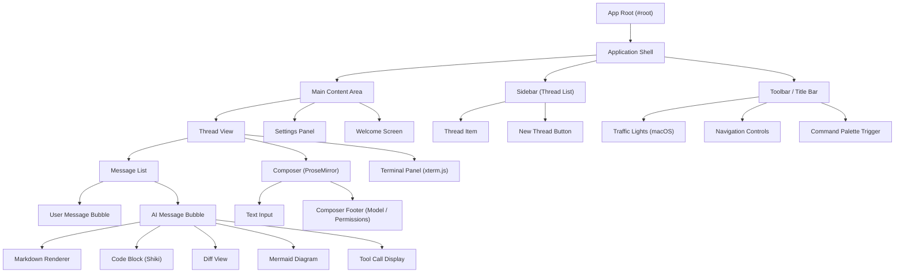
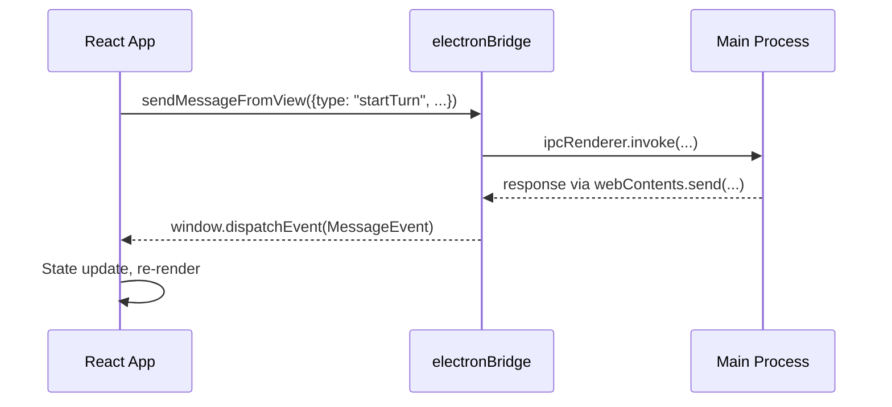
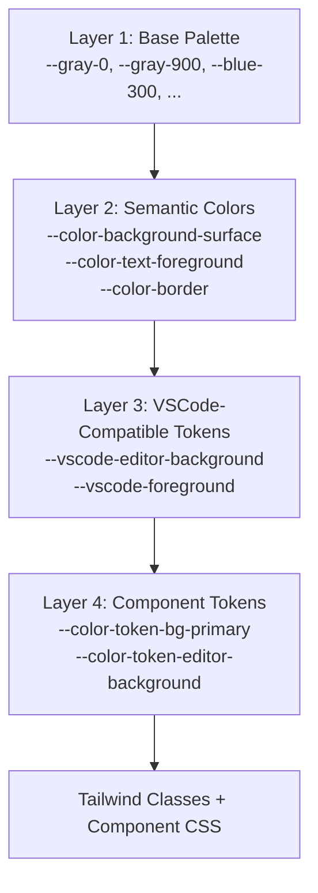

# 04 -- Renderer & Frontend

> The renderer is a React application running inside Chromium's sandbox. It owns the entire user interface -- from the chat thread to the integrated terminal. This document covers the frontend architecture, component model, and theming system.

---

## Technology Stack

The renderer is built with a modern frontend stack, bundled by Vite into a single distributable.

| Technology | Role |
|------------|------|
| React | Component framework and state management |
| Vite | Build tool, module bundler, code splitting |
| Tailwind CSS | Utility-first CSS framework |
| ProseMirror | Rich text editor for the message composer |
| xterm.js | Terminal emulator for inline terminal views |
| Shiki | Syntax highlighting (430+ language grammars) |
| Mermaid.js | Diagram rendering in AI responses |
| Immer | Immutable state updates |
| Zod | Runtime type validation |

---

## Bundle Structure

The Vite build produces two primary artifacts:

- **`index-DEdUduNg.js`** (~6.5 MB minified) -- The complete React application including all component code, state management, Sentry SDK, and Shiki core.
- **`index-Chvtit8s.css`** (~300 KB) -- The compiled Tailwind stylesheet plus custom component styles.

Additionally, Vite code-splits 430+ language grammar files and theme definitions into separate chunks that load on demand when a user views code in that language.

---

## Component Architecture

---

## Communication with the Main Process

The renderer has exactly one way to talk to the main process: the `electronBridge` object injected by the preload script.

### Sending Messages

All outgoing communication goes through `electronBridge.sendMessageFromView()`. The renderer wraps every action (start thread, send message, open file, change settings) into a structured message object and sends it through this single channel.

### Receiving Messages

The renderer listens for `MessageEvent` objects on `window`. The preload script converts every `codex_desktop:message-for-view` IPC event into a standard DOM MessageEvent. The React application has a top-level event listener that dispatches incoming messages to the appropriate state handler.

### Worker Communication (Git)

Git operations follow a parallel path. The renderer calls `electronBridge.sendWorkerMessageFromView("git", message)` and subscribes to responses via `electronBridge.subscribeToWorkerMessages("git", callback)`. This bypasses the DevboxSessionHandler entirely -- messages go directly to the Git worker thread.

---

## Theming System

The theming system is a four-layer CSS variable cascade designed for maximum flexibility without runtime JavaScript.

### Layer 1: Base Palette

The foundation is a set of color scales: `--gray-0` through `--gray-1000`, plus `--blue-*`, `--red-*`, `--green-*`, `--orange-*`, `--yellow-*`, `--purple-*`. These are raw color values with no semantic meaning.

### Layer 2: Semantic Colors

Semantic variables map palette colors to purposes: `--color-background-surface` is the main background, `--color-text-foreground` is the primary text color. These variables change between light and dark mode.

### Layer 3: VSCode-Compatible Tokens

A large set of `--vscode-*` variables provides compatibility with VSCode-style theming. The editor background, foreground, selection colors, and widget styles all follow VSCode naming conventions. This allows the code editor components to use standard VSCode theme tokens.

### Layer 4: Component Tokens

The final layer (`--color-token-*`) is what Tailwind classes and component CSS actually reference. These variables are thin wrappers that resolve to Layer 3, but provide an additional abstraction point for component-specific overrides.

### Dark Mode Activation

Dark mode is controlled by two mechanisms:
1. The CSS class `.dark:electron-dark` applied to the root element.
2. The `@media (prefers-color-scheme: dark)` media query for non-Electron contexts.

When dark mode activates, every semantic variable in Layer 2 switches to its dark counterpart. The base palette itself may also be overridden (as the custom navy theme demonstrates).

### Custom Theme Override

Custom themes are applied by loading an additional CSS file after the main stylesheet. This file overrides Layer 1 (palette) and Layer 2 (semantic) variables within the dark mode context, causing all downstream layers to automatically adopt the new colors through the CSS variable cascade.

---

## Rendering Pipeline

### Markdown and Code

AI responses arrive as a stream of text tokens. The renderer accumulates these tokens into a message buffer and renders them through a Markdown pipeline:

1. **Raw text** -- Accumulated from streaming tokens.
2. **Markdown parsing** -- Converted to an AST (Abstract Syntax Tree).
3. **Code block detection** -- Fenced code blocks are extracted and routed to Shiki.
4. **Shiki highlighting** -- Code blocks are tokenized and styled using the active theme.
5. **Mermaid detection** -- Fenced blocks with `mermaid` language tag are rendered as SVG diagrams.
6. **Diff detection** -- Special diff blocks are rendered with added/removed line highlighting.
7. **Final render** -- The complete message is rendered as React components.

### Terminal Rendering

The integrated terminal uses xterm.js, which renders characters into a canvas element. Terminal output from the CLI (tool execution results, command output) is piped from the main process to the xterm instance via the IPC bridge.

---

## State Management

The renderer uses a combination of React state, context providers, and event-driven updates:

- **Local component state** -- For UI-only concerns (input focus, scroll position, animation state).
- **React Context** -- For app-wide state (current thread, auth status, settings).
- **Window event listener** -- For data arriving from the main process (thread updates, streaming tokens, notifications).
- **Immer** -- For immutable state updates in complex reducers.

There is no centralized state store like Redux. Instead, the architecture relies on the fact that the main process is the single source of truth. The renderer is a projection of the main process state, updated via IPC events.

---

## Content Security Policy

The renderer operates under a strict CSP that limits what it can do:

| Directive | Value | Meaning |
|-----------|-------|---------|
| `default-src` | `'none'` | Block everything by default |
| `script-src` | `'self' 'wasm-unsafe-eval'` | Only same-origin scripts, allow WASM |
| `style-src` | `'self' 'unsafe-inline'` | Same-origin stylesheets, inline styles |
| `img-src` | `'self' https: data: blob:` | Images from app, HTTPS, data URIs, blobs |
| `connect-src` | `'self' https://ab.chatgpt.com https://cdn.openai.com` | API connections limited to OpenAI |
| `font-src` | `'self' data:` | Fonts from app and data URIs |
| `worker-src` | `'self' blob:` | Web workers from same origin |

This CSP prevents XSS attacks even if an attacker manages to inject content into an AI response.

---

## Next Document

Continue to [05 -- IPC Protocol](05-ipc-protocol.md) for the complete Inter-Process Communication specification.
