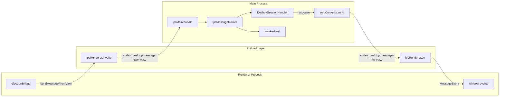
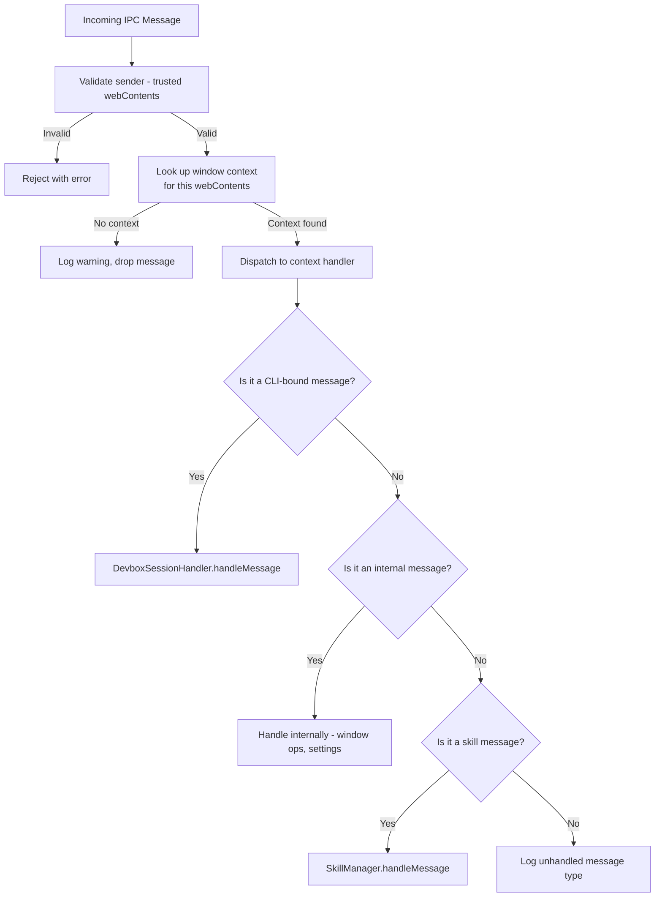

# 05 -- IPC Protocol

> Every interaction between the sandboxed renderer and the privileged main process passes through a well-defined set of IPC channels. This document specifies all channels, their message formats, and the routing logic that connects them.

---

## Channel Architecture

---

## Channel Registry

### Primary Channels

| Channel | Direction | Type | Purpose |
|---------|-----------|------|---------|
| `codex_desktop:message-from-view` | Renderer -> Main | `handle` (async) | All application messages |
| `codex_desktop:message-for-view` | Main -> Renderer | `send` | All application responses and events |

These two channels carry the vast majority of traffic. Every user action, CLI response, and state update flows through them.

### Worker Channels

| Channel | Direction | Type | Purpose |
|---------|-----------|------|---------|
| `codex_desktop:worker:git:from-view` | Renderer -> Main | `handle` (async) | Git operation requests |
| `codex_desktop:worker:git:for-view` | Main -> Renderer | `send` | Git operation responses |

Worker channels are dynamically named by worker type. Currently only `git` exists, but the pattern supports additional worker types.

### System Channels

| Channel | Direction | Type | Purpose |
|---------|-----------|------|---------|
| `codex_desktop:show-context-menu` | Renderer -> Main | `handle` (async) | Display native context menu |
| `codex_desktop:check-for-updates` | Renderer -> Main | `handle` (async) | Trigger Sparkle update check |
| `codex_desktop:get-sentry-init-options` | Renderer -> Main | `on` (sync) | Retrieve Sentry configuration |
| `codex_desktop:get-build-flavor` | Renderer -> Main | `on` (sync) | Retrieve build flavor string |
| `codex_desktop:trigger-sentry-test` | Renderer -> Main | `handle` (async) | Trigger a test error for Sentry |

### Sentry Channels

| Channel | Direction | Type | Purpose |
|---------|-----------|------|---------|
| `sentry-ipc.start` | Renderer -> Main | `on` | Sentry SDK initialization |
| `sentry-ipc.scope` | Renderer -> Main | `on` | Scope context updates |
| `sentry-ipc.envelope` | Renderer -> Main | `on` | Error/event envelopes |
| `sentry-ipc.structured-log` | Renderer -> Main | `on` | Structured log entries |
| `sentry-ipc.metric` | Renderer -> Main | `on` | Performance metrics |
| `sentry-ipc.status` | Renderer -> Main | `on` | Status heartbeats |

---

## Message Routing

When a message arrives at `codex_desktop:message-from-view`, the routing logic follows this decision tree:

### Sender Validation

Every IPC handler calls `validateSender(event)` before processing. This function verifies that the `event.senderFrame` originates from a known, trusted webContents instance registered with the WindowManager. Messages from unknown sources are silently rejected.

This prevents a compromised renderer (or a rogue webview) from sending commands to the main process.

---

## Message Types

Messages on the primary channel carry a `type` field that determines their handling. The major categories are:

### Thread Operations
- **startThread** -- Create a new conversation thread.
- **deleteThread** -- Remove a thread and its history.
- **pinThread / unpinThread** -- Pin or unpin a thread in the sidebar.
- **archiveThread** -- Move a thread to the archive.
- **renameThread** -- Update a thread's title.

### Turn Operations
- **startTurn** -- Send a user message and begin an AI response.
- **interruptTurn** -- Cancel the current AI response mid-stream.
- **retryTurn** -- Regenerate the last AI response.

### Terminal Operations
- **createTerminalSession** -- Open a new terminal session.
- **writeTerminalInput** -- Send keystrokes to a terminal.
- **resizeTerminal** -- Update terminal dimensions.
- **closeTerminalSession** -- Destroy a terminal session.

### MCP Operations
- **connectMcpServer** -- Establish connection to an MCP server.
- **listMcpTools** -- Enumerate available tools from connected servers.
- **disconnectMcpServer** -- Close an MCP server connection.

### Fetch Proxy
- **proxyFetch** -- HTTP request that needs auth headers injected. The main process performs the fetch using `electron.net.fetch()`, attaches authentication headers, and returns the response to the renderer.

### Desktop Integration
- **showNotification** -- Display a native desktop notification.
- **setPowerSaveBlocker** -- Prevent the system from sleeping during long operations.
- **setWorkspaceRoot** -- Change the active workspace directory.

### Configuration
- **readConfig** -- Read a configuration value.
- **writeConfig** -- Write a configuration value.
- **readConfigRequirements** -- Check what configuration is required for a feature.

---

## Response Routing

Responses from the CLI or from internal handlers flow back through `codex_desktop:message-for-view`. The main process uses `webContents.send()` to target a specific renderer, or `broadcastToWindows()` to send to all renderers.

### Broadcast vs. Targeted

Some events are broadcast to all windows (thread list updates, auth state changes), while others are targeted to the window that made the request (turn responses, fetch results). The DevboxSessionHandler tracks which webContents initiated each request and routes responses accordingly.

### Request-Response Correlation

Each request carries a unique `requestId`. The main process (or CLI) includes this ID in the response, allowing the renderer to match responses to their originating requests. Unmatched responses (events, broadcasts) have no request ID and are processed as state updates.

---

## Next Document

Continue to [06 -- CLI Bridge](06-cli-bridge.md) for the stdio transport protocol between the main process and the Rust CLI.
