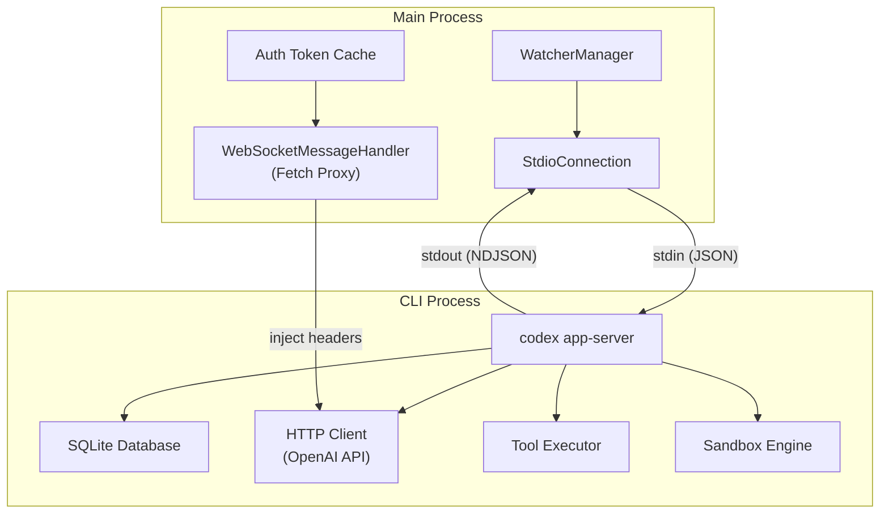
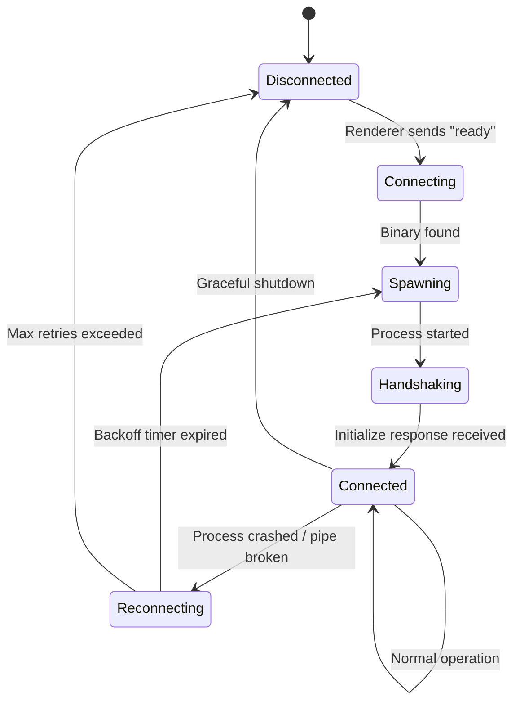
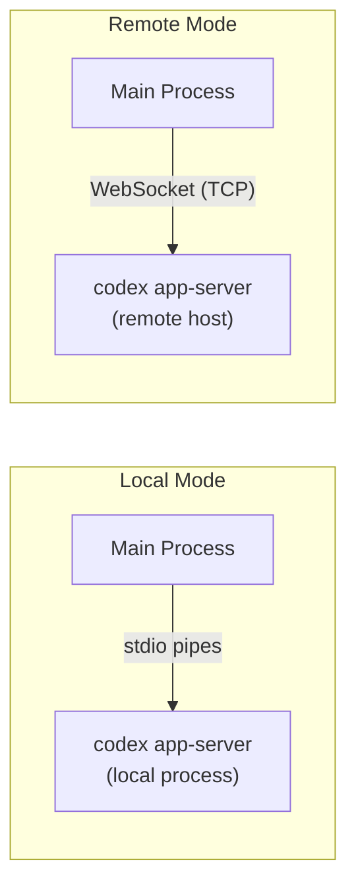

# 06 -- CLI Bridge

> The Rust CLI binary is the brains of the operation. The Electron main process treats it as a background daemon, communicating over a stdio transport. This document covers binary discovery, process lifecycle, the wire protocol, and failure recovery.

---

## Architecture

---

## Binary Discovery

When the main process needs the CLI binary, it searches these locations in order:

1. **Environment override** -- `CODEX_CLI_PATH` or `CUSTOM_CLI_PATH` environment variables. Used in development to point at a locally compiled binary.
2. **App resources** -- `process.resourcesPath/codex` inside the application bundle. This is where the production binary lives.
3. **Unpacked resources** -- `process.resourcesPath/app.asar.unpacked/codex` for builds where the binary is excluded from the asar archive.
4. **Extension bin** -- `<repoRoot>/extension/bin/codex` for VS Code extension development.
5. **Host config override** -- `hostConfig.codex_cli_command` allows per-host custom commands.

The search is sequential -- the first hit wins. If no binary is found, the application enters a degraded state where AI features are unavailable.

---

## Process Lifecycle

### Spawning

The CLI is spawned with `child_process.spawn()`:

- **Executable:** The discovered binary path.
- **Arguments:** `["app-server", "--analytics-default-enabled"]`
- **stdio:** `["pipe", "pipe", "pipe"]` -- stdin, stdout, and stderr are all piped.
- **Environment:** Inherits the parent environment plus `RUST_LOG` for debug logging and `CODEX_INTERNAL_ORIGINATOR_OVERRIDE` for request attribution.

### Handshake

Immediately after spawning, the main process sends an initialization request with a well-known ID (`__codex-desktop_initialize__`). The CLI responds with its capabilities, version, and supported features. Only after this handshake succeeds does the connection state transition to "connected."

### Normal Operation

During normal operation, the main process writes JSON messages to the CLI's stdin and reads NDJSON responses from stdout. Stderr is captured for logging but not parsed as protocol messages.

### Failure and Recovery

If the CLI process exits unexpectedly or the pipe breaks:

1. The StdioConnection detects the failure (SIGPIPE, EPIPE, or process exit event).
2. The connection state transitions to "reconnecting."
3. An exponential backoff timer starts (initial delay ~1 second, maximum ~30 seconds, with jitter).
4. When the timer fires, a new CLI process is spawned.
5. Pending requests are either retried or rejected depending on their idempotency.
6. The renderer is notified of the temporary disconnection.

---

## Wire Protocol

### Message Format

Messages are newline-delimited JSON (NDJSON). Each line on stdin or stdout is a complete, self-contained JSON object.

### Request Messages (Main -> CLI)

Request messages follow a JSON-RPC-like structure:

| Field | Type | Required | Description |
|-------|------|----------|-------------|
| `id` | string | Yes | Unique request identifier for correlation |
| `method` | string | Yes | The operation to perform |
| `params` | object | No | Method-specific parameters |

### Response Messages (CLI -> Main)

Response messages include the request ID for correlation:

| Field | Type | Required | Description |
|-------|------|----------|-------------|
| `id` | string | Yes | Matches the originating request |
| `result` | any | Conditional | Success payload (mutually exclusive with `error`) |
| `error` | object | Conditional | Error payload with `code` and `message` fields |

### Event Messages (CLI -> Main)

Events are unsolicited messages with no `id` field:

| Field | Type | Required | Description |
|-------|------|----------|-------------|
| `method` | string | Yes | The event type |
| `params` | object | No | Event-specific data |

Events are used for streaming (token-by-token AI responses), status updates, and asynchronous notifications.

---

## Method Catalog

### Authentication

| Method | Direction | Purpose |
|--------|-----------|---------|
| `getAuthStatus` | Request | Retrieve current auth token |
| `account/read` | Request | Read account information |

### Thread Management

| Method | Direction | Purpose |
|--------|-----------|---------|
| `thread/start` | Request | Create a new conversation thread |
| `thread/list` | Request | List all conversation threads |
| `thread/update` | Event | Streaming thread content update |
| `thread/delete` | Request | Delete a thread |

### Turn Management

| Method | Direction | Purpose |
|--------|-----------|---------|
| `turn/start` | Request | Begin a new turn (send user message) |
| `turn/interrupt` | Request | Cancel the current AI response |

### Configuration

| Method | Direction | Purpose |
|--------|-----------|---------|
| `config/read` | Request | Read configuration values |
| `config/write` | Request | Write configuration values |
| `configRequirements/read` | Request | Check required configuration |

### Models and Features

| Method | Direction | Purpose |
|--------|-----------|---------|
| `model/list` | Request | List available AI models |
| `app/list` | Request | List available applications/integrations |
| `skills/list` | Request | List installed skills |
| `mcpServerStatus/list` | Request | List MCP server connection statuses |
| `collaborationMode/list` | Request | List collaboration modes |

---

## Alternative Transport: WebSocket

For remote environments (devbox, SSH), the stdio transport is replaced by a WebSocket connection. The wire protocol remains identical -- JSON messages over the connection -- but the transport layer changes from pipes to TCP.

The `CODEX_APP_SERVER_WS_URL` environment variable triggers WebSocket mode. When set, the DevboxSessionHandler creates a `WebSocketConnection` instead of a `StdioConnection`.

---

## Next Document

Continue to [07 -- Authentication Flow](07-authentication-flow.md) for the complete authentication system.
