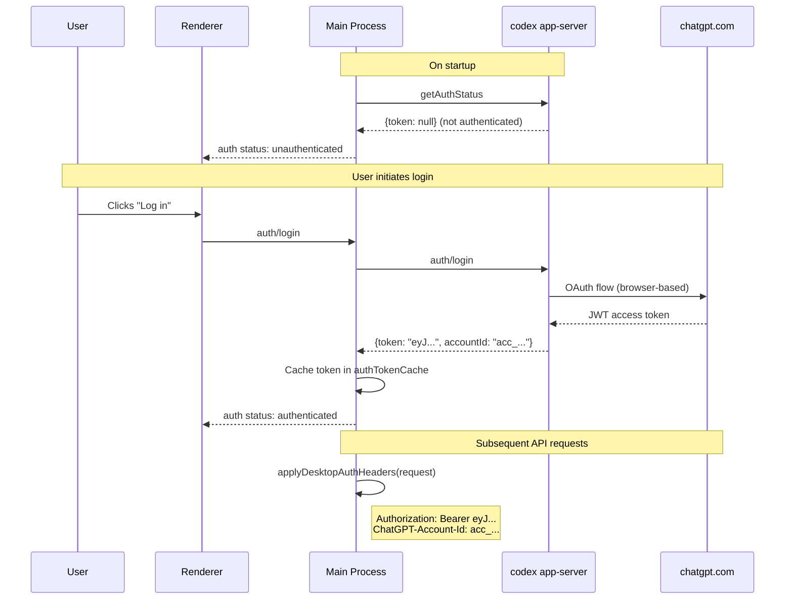
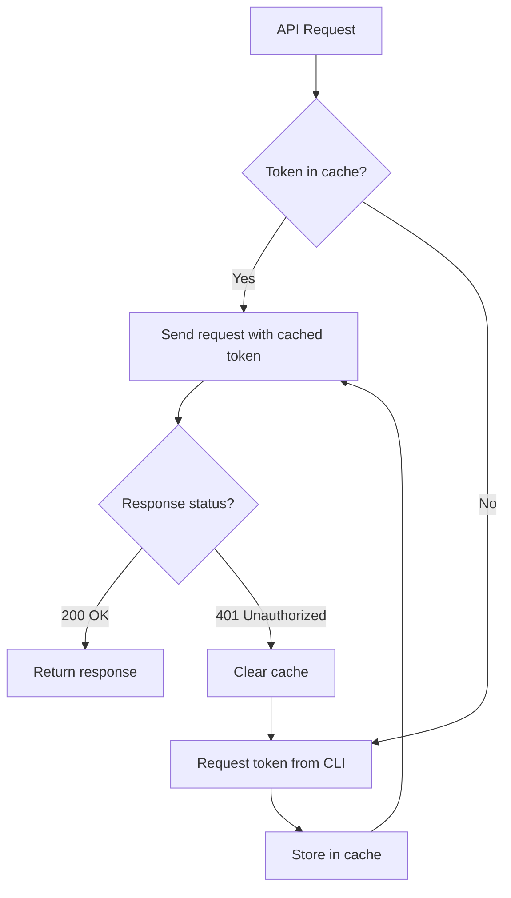

# 07 -- Authentication Flow

> Authentication connects the desktop application to the user's OpenAI account. The flow spans all three layers -- the renderer initiates login, the main process manages tokens, and the CLI handles credential storage and API authentication.

---

## Authentication Architecture

---

## Token Structure

The authentication token is a JSON Web Token (JWT) issued by OpenAI's auth service. Its payload contains:

| Claim | Purpose |
|-------|---------|
| `sub` | User identifier (`user-xxxxx`) |
| `https://api.openai.com/auth.chatgpt_account_id` | The ChatGPT account ID used for billing and access control |
| `exp` | Token expiration timestamp |
| `iat` | Token issuance timestamp |

The main process extracts the `chatgpt_account_id` from the JWT payload by Base64URL-decoding the middle segment of the token. This account ID is sent as a separate header (`ChatGPT-Account-Id`) on every API request.

---

## Token Caching

The main process maintains an in-memory token cache (`authTokenCache`) to avoid requesting a fresh token from the CLI on every API call. The cache invalidation strategy is:

1. **On 401 response** -- If any API request returns HTTP 401, the cached token is cleared and a fresh token is requested from the CLI.
2. **On explicit logout** -- The user logs out through the UI, clearing both the cache and the CLI's credential store.
3. **On CLI restart** -- The cache is cleared when the CLI process is respawned.

The CLI itself persists tokens to disk in its own credential store, so tokens survive application restarts.

---

## Header Injection

The `WebSocketMessageHandler` intercepts all outgoing HTTP requests from the renderer (proxied through the `proxyFetch` IPC message) and injects authentication headers.

### Headers Applied

| Header | Value | Purpose |
|--------|-------|---------|
| `Authorization` | `Bearer <JWT>` | API authentication |
| `ChatGPT-Account-Id` | `acc_xxxxx` | Account identification |
| `Originator` | `codex-app` | Request attribution |
| `User-Agent` | `codex-app/<version>` | Client identification |

### Domain Validation

Headers are only injected for requests to trusted domains. The `shouldAttachAuth()` function checks the request URL against an allowlist:

- `localhost` and `localhost:8000` (development)
- `openai.com` and `*.openai.com`
- `chatgpt.com` and `*.chatgpt.com` (excluding `ab.chatgpt.com` which is the A/B testing endpoint)

Requests to any other domain pass through without authentication headers, preventing token leakage to third-party services.

---

## Token Refresh

The refresh cycle is bounded -- if a refreshed token also results in a 401, the application transitions to an unauthenticated state and prompts the user to log in again.

---

## Next Document

Continue to [08 -- Conversation Engine](08-conversation-engine.md) for thread and turn management.
