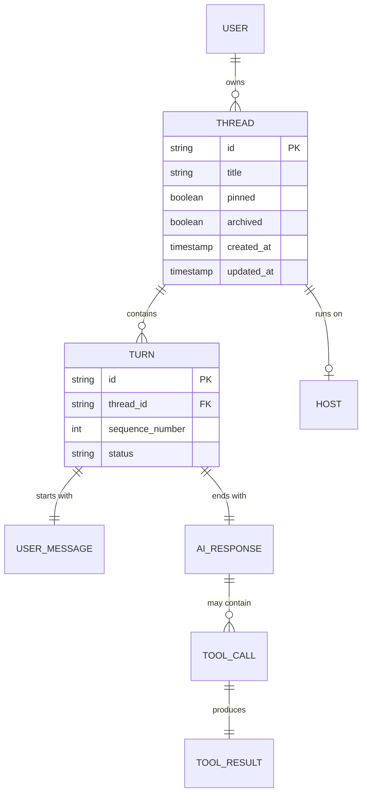
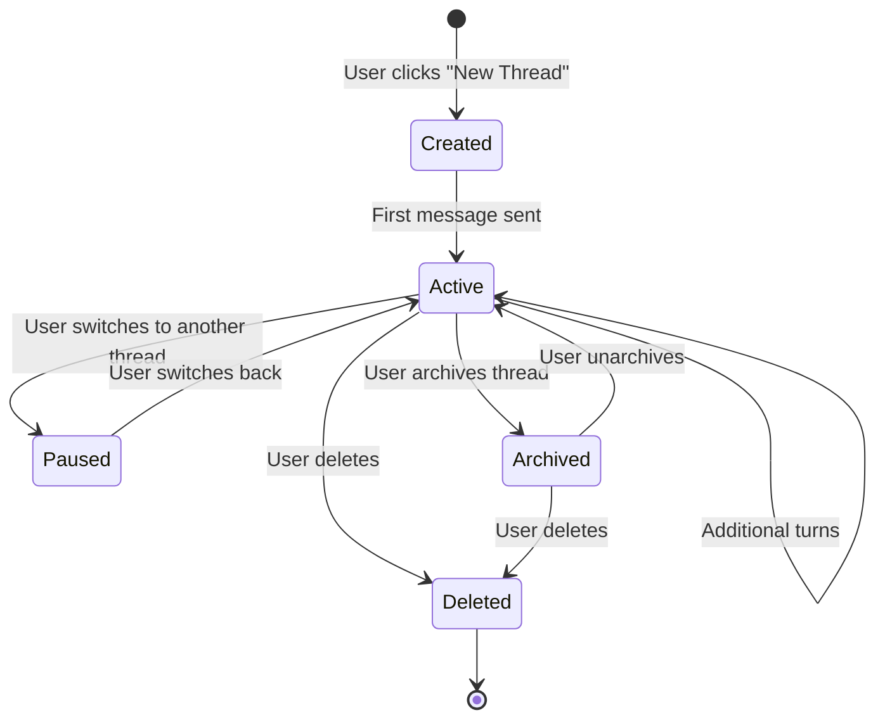
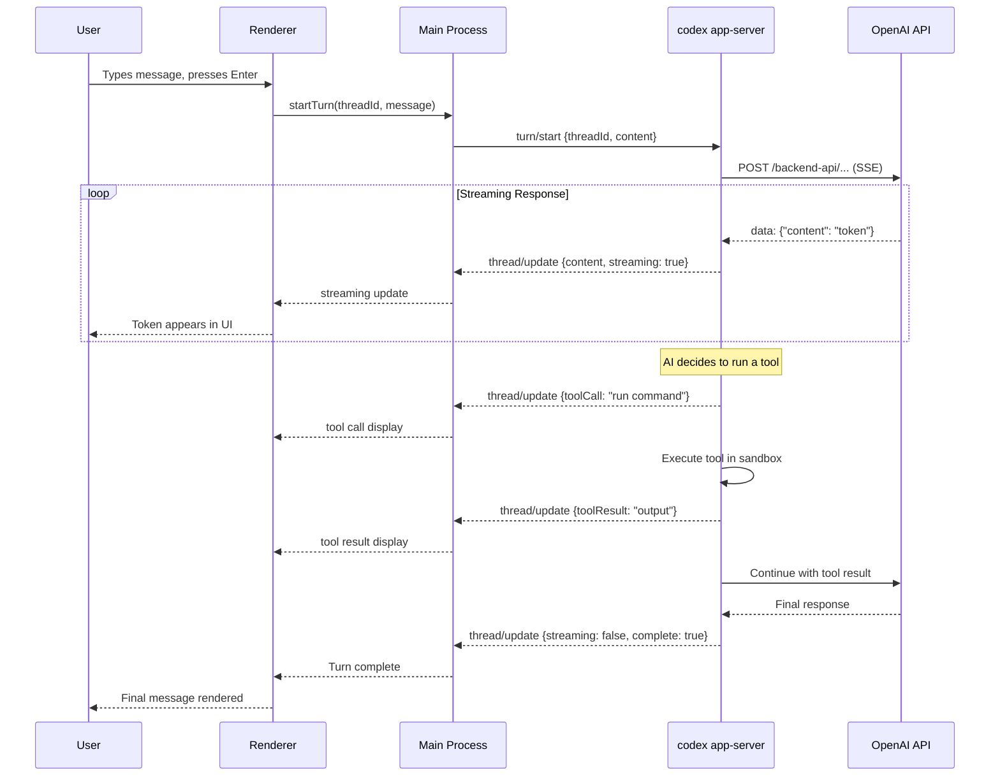

# 08 -- Conversation Engine

> Conversations are the core user-facing abstraction. A user opens a thread, types messages, receives AI responses, and watches the AI execute tools. This document covers how threads and turns are managed across all three layers.

---

## Domain Model

| Concept | Description |
|---------|-------------|
| **Thread** | A conversation session. Has an ID, title, creation timestamp, and associated host. Persisted in SQLite. |
| **Turn** | One round of interaction: the user sends a message, the AI responds. A thread has many turns. |
| **User Message** | The text the user typed. May include file references, code snippets, or tool results from previous turns. |
| **AI Response** | The model's reply. May be plain text, markdown with code blocks, or a sequence of tool calls. |
| **Tool Call** | An action the AI wants to perform (run a command, read a file, write a file). Requires sandbox approval. |
| **Tool Result** | The output of executing a tool call. Fed back to the model for the next reasoning step. |
| **Host** | The execution environment (local machine, SSH remote, devbox). Determines which CLI instance handles the thread. |

---

## Thread Lifecycle

### Thread Creation

When the user starts a new conversation, the renderer sends a `startThread` message through IPC. The main process forwards it to the CLI as `thread/start`. The CLI:

1. Generates a unique thread ID.
2. Creates a database record in SQLite.
3. Returns the thread metadata to the main process.
4. The main process forwards it to the renderer, which adds the thread to the sidebar.

### Thread Persistence

All thread data is persisted in the CLI's SQLite database (`~/.codex/sqlite/codex.db`). The main process never writes to this database directly -- all writes go through the CLI. This ensures consistency between the desktop app and the standalone CLI tool.

---

## Turn Lifecycle

### Streaming

AI responses arrive token-by-token via Server-Sent Events (SSE) from the OpenAI API. The CLI parses the SSE stream, accumulates tokens into a buffer, and periodically flushes update events to the main process. The main process forwards these to the renderer, which appends the new tokens to the message display.

This creates the "typing" effect where the AI response appears character by character.

### Tool Execution

When the AI decides to use a tool (run a terminal command, read a file, write a file), the flow pauses the streaming response:

1. The CLI emits a tool call event.
2. The renderer shows the proposed action to the user.
3. Depending on the sandbox policy, the action either executes automatically or waits for user approval.
4. The tool executes and produces a result.
5. The result is fed back to the model.
6. The model continues its response with the tool result as context.

This cycle can repeat multiple times within a single turn -- the AI may chain several tool calls before producing its final text response.

### Interruption

If the user clicks "Stop" during a turn:

1. The renderer sends `interruptTurn` through IPC.
2. The main process sends `turn/interrupt` to the CLI.
3. The CLI sends an abort signal to the HTTP connection.
4. The SSE stream terminates.
5. The partial response is preserved in the thread history.
6. The turn is marked as interrupted.

---

## Model Selection

The application currently supports two models:

| Model ID | Characteristics |
|----------|-----------------|
| `gpt-5.1-codex-mini` | Fast, cost-efficient, good for simple tasks |
| `gpt-5.2-codex` | Most capable, slower, used for complex reasoning |

Model selection is stored per-thread and can be changed by the user through the composer footer. The selected model ID is passed to the CLI with every `turn/start` request.

---

## Ephemeral Threads

Some interactions create temporary threads that are not persisted to the thread list:

- Quick fixes from inline suggestions.
- One-off questions from the command palette.
- Background operations triggered by automations.

Ephemeral threads have an ID and participate in the normal turn lifecycle, but they are not shown in the sidebar and are garbage-collected after a configurable TTL.

---

## Next Document

Continue to [09 -- Window System](09-window-system.md) for window creation and management.
