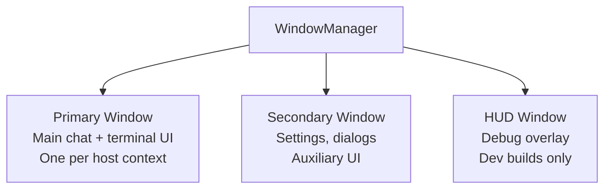
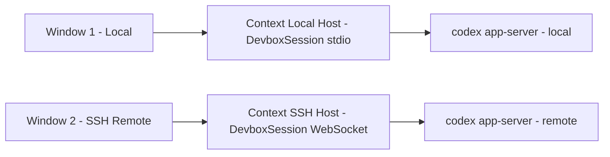

# 09 -- Window System

> The WindowManager is the most central module in the main process. It owns every BrowserWindow instance, maps each to a host context, and provides the messaging infrastructure that connects renderers to backends.

---

## Window Types

| Type | Purpose | Count | Visible to User |
|------|---------|-------|-----------------|
| Primary | Main application window with chat, terminal, sidebar | One per host | Yes |
| Secondary | Settings panel, dialog boxes, auxiliary views | Zero or more | Yes |
| HUD | Debug heads-up display showing internal metrics | Zero or one | Only in dev builds |

---

## Window Configuration

Primary windows are created with platform-specific settings designed for a native feel on macOS:

| Setting | Value | Reasoning |
|---------|-------|-----------|
| `titleBarStyle` | `hiddenInset` | Traffic lights are inset into the content area, the app provides its own toolbar |
| `vibrancy` | `under-window` | Desktop background blurs through the window for depth |
| `transparent` | `true` | Required for vibrancy effect |
| `backgroundColor` | `#00000000` | Transparent base for vibrancy compositing |
| `contextIsolation` | `true` | Renderer cannot access Node.js |
| `nodeIntegration` | `false` | Additional security layer |
| `sandbox` | `true` | Chromium sandbox active |
| `preload` | `preload.js` | Injects the electronBridge |
| `webviewTag` | `false` | Prevents renderer from creating webviews |

For opaque mode (when vibrancy is disabled or unsupported), the background switches to the solid surface color and the `electron-opaque` class is applied to the root element.

---

## Window-to-Context Mapping

Each window is associated with a **host context** -- an object that holds the DevboxSessionHandler, thread state, and host-specific configuration for that window.

When the user opens a window for a different host, a new context is created with its own CLI connection. This allows simultaneous work on local and remote environments.

---

## Bounds Persistence

Window position and size are saved to the GlobalStateStore and restored on the next launch:

1. On window `move` or `resize` events, the new bounds are debounce-written to the state store.
2. Bounds are stored per-host, so each host remembers its own window position.
3. On startup, `restorePrimaryWindowBounds()` reads the stored bounds and applies them.
4. If no stored bounds exist (first launch), default dimensions are used.

---

## Renderer Lifecycle Tracking

The WindowManager tracks whether each renderer is "ready" -- meaning the React application has booted and sent its ready message. This prevents the main process from sending messages to a renderer that has not yet initialized its event listeners.

If a renderer crashes and reloads, its ready state resets. The main process waits for the new ready message before resuming communication.

---

## Next Document

Continue to [10 -- Terminal System](10-terminal-system.md) for PTY management and terminal integration.
