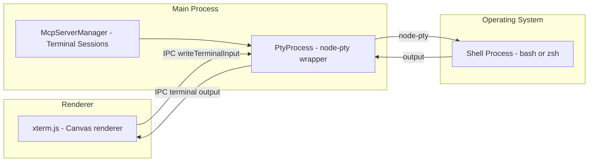
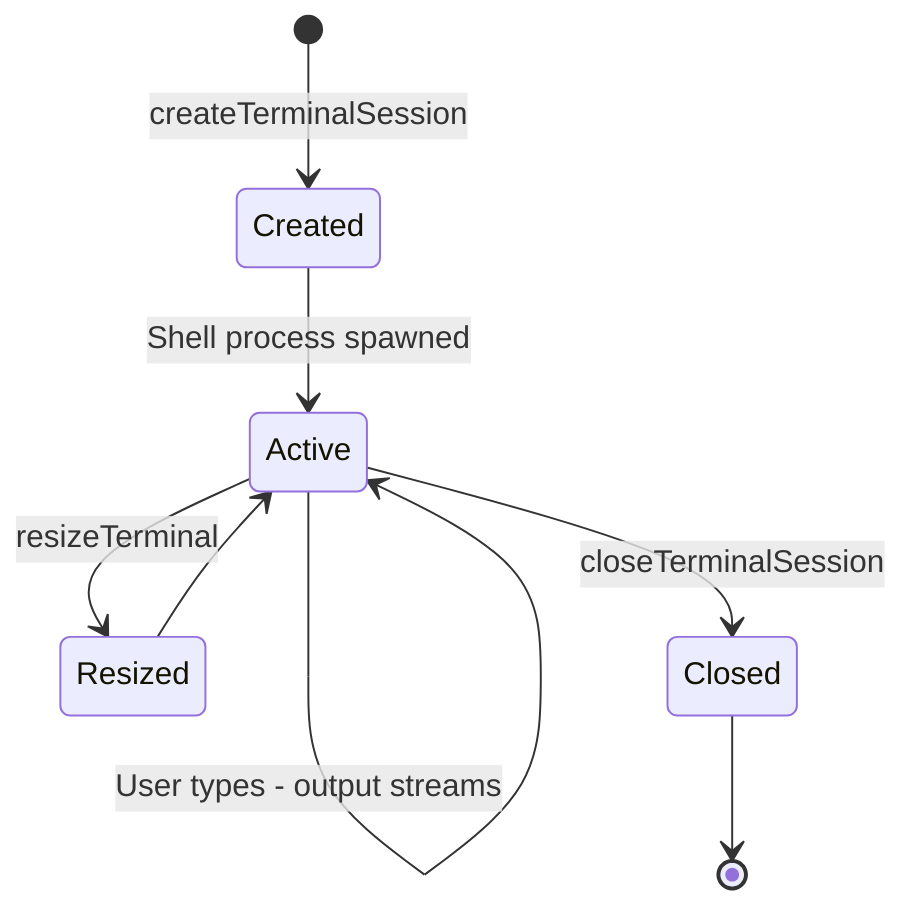

# 10 -- Terminal System

> The terminal subsystem connects two worlds: the renderer's xterm.js visual terminal and the main process's node-pty pseudo-terminal. Together they give the AI the ability to execute commands and the user the ability to see and interact with the output.

---

## Architecture

---

## PtyProcess

The `PtyProcess` class wraps the `node-pty` native addon, providing a higher-level API:

| Capability | Description |
|------------|-------------|
| Process creation | Spawns a shell with proper environment, working directory, and terminal dimensions |
| Output buffering | Accumulates stdout and stderr into memory buffers |
| Exit tracking | Records exit codes and termination signals |
| Promise-based wait | Allows callers to `await` process completion |
| Graceful termination | Sends SIGTERM followed by SIGKILL after a timeout |

The `node-pty` addon uses OS-level pseudo-terminals (PTY), which means the spawned shell behaves exactly as it would in a real terminal -- including ANSI escape codes, line editing, and signal handling.

---

## Terminal Session Lifecycle

### Creation

When the renderer requests a terminal session, the main process:

1. Determines the working directory (usually the workspace root).
2. Resolves the user's default shell.
3. Sets up the environment (PATH, TERM, COLORTERM, shell-specific variables).
4. Spawns the shell via `PtyProcess` with initial dimensions from the renderer.

### Input/Output

- **User input** travels: xterm.js -> IPC `writeTerminalInput` -> PtyProcess -> stdin of the shell.
- **Shell output** travels: stdout of the shell -> PtyProcess `onData` -> IPC event -> xterm.js.

The output path is buffered -- PtyProcess accumulates output and flushes it to the renderer in batches to avoid overwhelming the IPC channel with per-character messages.

### Resize

When the user resizes the terminal panel, the renderer sends new column and row counts. The main process calls `pty.resize(cols, rows)`, which sends a `SIGWINCH` signal to the shell, causing it to redraw its output for the new dimensions.

---

## MCP Terminal Sessions

MCP servers also use terminal sessions for their stdio communication. The McpServerManager creates dedicated terminal sessions per conversation:

- Each MCP server connection gets its own PTY.
- Terminal buffers are capped at 16 KB to prevent memory exhaustion from verbose servers.
- Sessions are associated with conversations and cleaned up when the conversation ends.
- The CWD of MCP terminal sessions is synchronized with the workspace root.

---

## AI Tool Execution

When the AI decides to run a terminal command, the flow is:

1. The CLI emits a tool call event describing the command.
2. The sandbox engine evaluates whether the command is allowed.
3. If approved, the CLI executes the command in a sandboxed environment.
4. The command output is captured and returned as a tool result.
5. The tool result is displayed in the renderer's terminal view and fed back to the model.

The desktop app does not execute AI commands directly -- the CLI's sandbox engine handles all execution and enforces approval policies.

---

## Next Document

Continue to [11 -- MCP Integration](11-mcp-integration.md) for Model Context Protocol server management.
