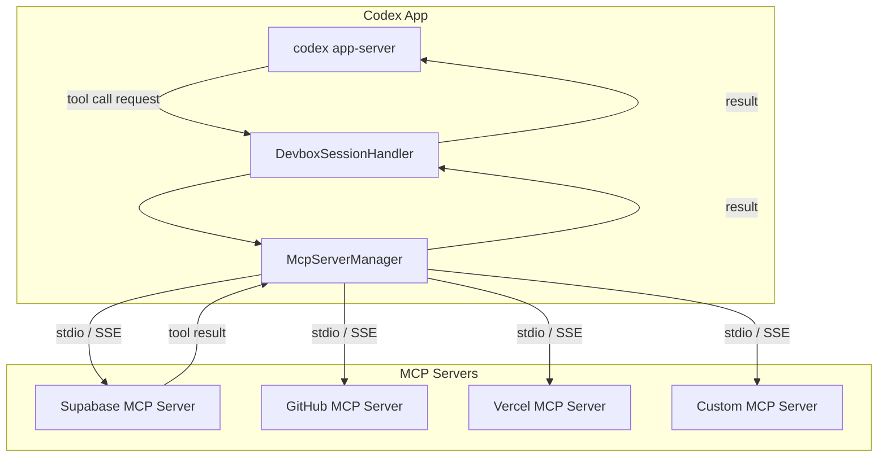
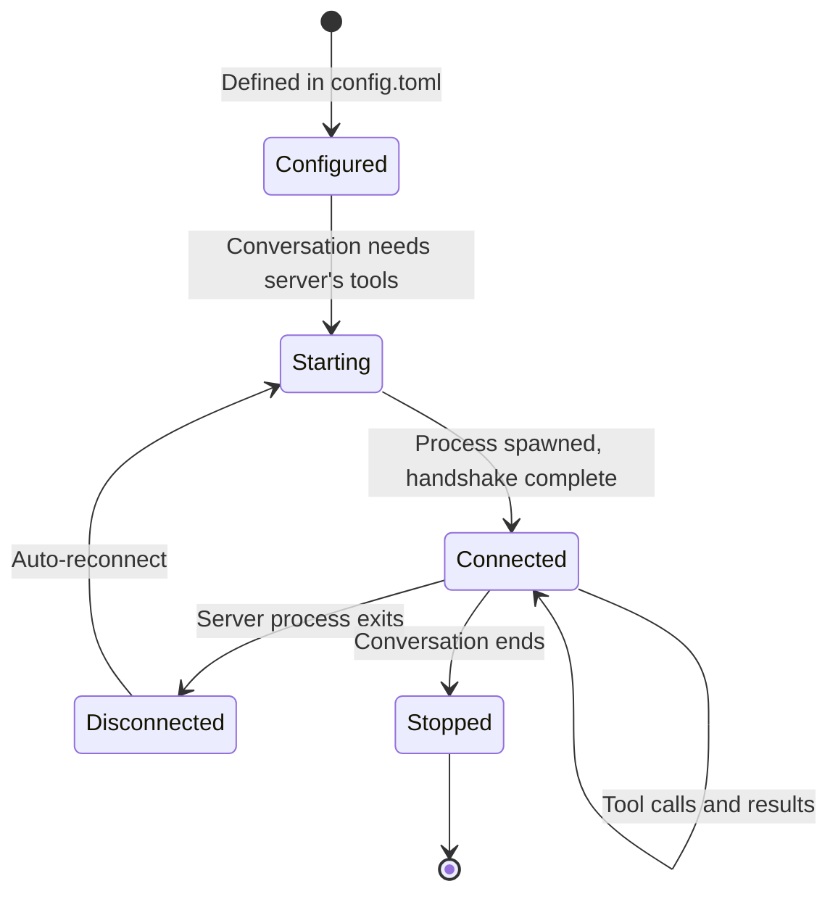

# 11 -- MCP Integration

> The Model Context Protocol (MCP) allows the AI to interact with external tools and services -- databases, APIs, cloud platforms -- through a standardized interface. The desktop app manages MCP server lifecycles and routes tool calls between the AI and the servers.

---

## Architecture

---

## Server Configuration

MCP servers are defined in `~/.codex/config.toml`:

| Field | Description |
|-------|-------------|
| `command` | The executable to run (e.g., `npx`) |
| `args` | Command-line arguments |
| `env` | Environment variables |
| `cwd` | Working directory |

Each server runs as a separate child process. The McpServerManager spawns them on demand when a conversation needs their tools and shuts them down when they are no longer needed.

---

## Connection Lifecycle

---

## Tool Discovery

When an MCP server connects, it advertises a list of available tools. Each tool has a name, description, and parameter schema. The McpServerManager aggregates tools from all connected servers and makes them available to the CLI, which in turn presents them to the AI model.

The AI model decides which tools to call based on the user's request and the tool descriptions. The desktop app's role is purely plumbing -- routing tool calls to the right server and returning results.

---

## Session Isolation

Each conversation can have its own set of MCP sessions. This isolation ensures that:

- A tool call in one conversation does not affect another.
- Server state (like database connections) is scoped to the conversation.
- Cleanup happens automatically when the conversation closes.

---

## Next Document

Continue to [12 -- Skills System](12-skills-system.md) for the plugin and skills architecture.
