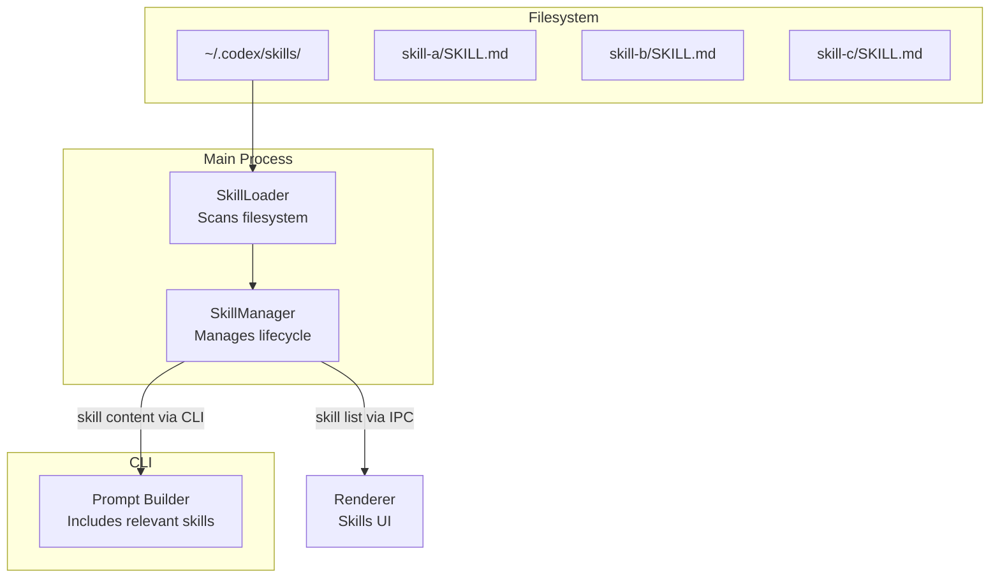

# 12 -- Skills System

> Skills are lightweight plugins that extend the AI's knowledge and capabilities. Unlike MCP servers (which provide tools), skills provide context -- domain-specific instructions, coding conventions, API documentation, or workflow guides.

---

## Architecture

---

## Skill Structure

Each skill lives in a subdirectory of `~/.codex/skills/`:

| File | Required | Purpose |
|------|----------|---------|
| `SKILL.md` | Yes | Markdown file containing the skill definition, instructions, and metadata |
| Supporting files | No | Additional resources the skill references |

The `SKILL.md` file is the only file the system reads automatically. Its content is injected into the AI's context when the skill is active, giving the model additional knowledge about a specific domain.

---

## Skill Loading

The `SkillLoader` scans the skills directory on startup and when explicitly refreshed. For each subdirectory containing a `SKILL.md`:

1. Reads the markdown file.
2. Extracts metadata (title, description, triggers).
3. Registers the skill with the SkillManager.

The loading is non-blocking -- a slow or corrupt skill file does not prevent the application from starting.

---

## Recommended Skills

Beyond locally installed skills, the system also suggests recommended skills from a curated GitHub repository. The SkillManager fetches this list and presents it in the UI, where users can install skills with a single click.

---

## App State Snapshots

The SkillManager participates in telemetry by collecting app state snapshots. These snapshots include anonymous statistics about skill usage (number of skills loaded, which skills are active) that help the development team understand adoption patterns.

---

## Next Document

Continue to [13 -- Git Subsystem](13-git-subsystem.md) for repository tracking and version control integration.
