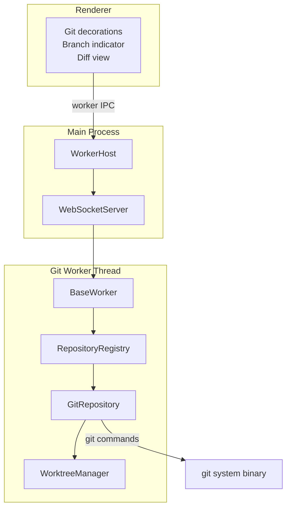
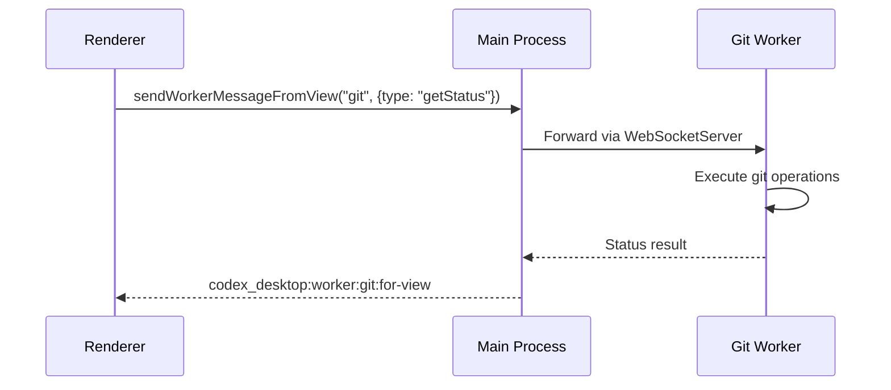

# 13 -- Git Subsystem

> Git integration gives the AI awareness of version control context -- which files are modified, what branch the user is on, and what changes have been made. The implementation runs in a dedicated worker thread to keep the main process responsive.

---

## Architecture

---

## Why a Worker Thread?

Git operations can be expensive -- scanning a large repository for status, computing diffs, or enumerating branches may take hundreds of milliseconds. Running these on the main thread would freeze the UI (since the main process handles IPC and window events on the same thread).

The solution is a dedicated Node.js worker thread. The `WorkerHost` spawns this thread at startup, and all Git operations are dispatched to it through a `WebSocketServer` running on a random local port.

---

## Components

### RepositoryRegistry

Discovers and tracks Git repositories in the workspace. When the user opens a directory, the registry walks upward from the workspace root to find `.git` directories. Each discovered repository is registered and monitored for changes.

### GitRepository

Represents a single Git repository. Provides methods for:

- Reading branch status (current branch, ahead/behind counts).
- Computing file-level status (modified, added, deleted, untracked).
- Generating diffs between working tree and index or between commits.
- Enumerating branches and tags.

### WorktreeManager

Handles Git worktrees -- multiple working directories linked to the same repository. This is useful for working on multiple branches simultaneously without stashing. The manager tracks active worktrees, creates new ones, and cleans up stale ones on startup.

---

## Communication Flow

The renderer never executes git commands directly. All git data flows through the worker thread, which caches results and uses filesystem watchers to invalidate the cache when files change.

---

## File Decorations

Git status information is used to decorate the file browser and message composer:

| Status | Decoration |
|--------|------------|
| Modified | Orange indicator, shows diff |
| Added | Green indicator |
| Deleted | Red indicator, strikethrough |
| Untracked | Gray indicator |
| Renamed | Blue indicator with arrow |

These decorations are computed in the worker thread and sent to the renderer as a flat map of file paths to statuses.

---

## Next Document

Continue to [14 -- State & Persistence](14-state-persistence.md) for data storage and configuration management.
