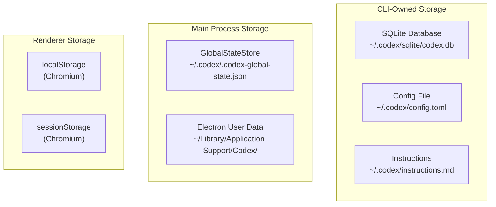
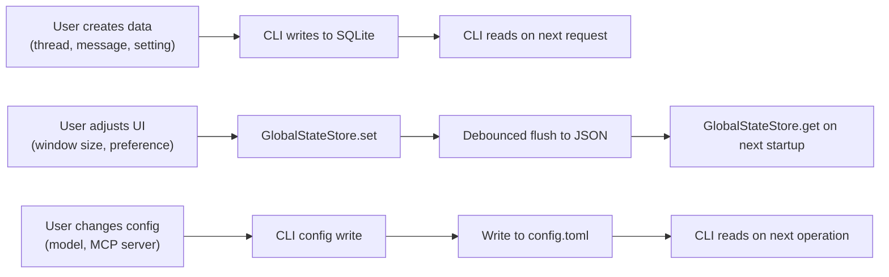

# 14 -- State & Persistence

> The application persists state across three different storage mechanisms, each optimized for a specific access pattern. This document covers the SQLite database, the GlobalStateStore, and the configuration file system.

---

## Storage Overview

---

## SQLite Database

### Location

| Environment | Path |
|-------------|------|
| Production | `~/.codex/sqlite/codex.db` |
| Development | `~/.codex/sqlite/codex-dev.db` |

### Ownership

The SQLite database is exclusively owned and managed by the CLI binary. The Electron main process never reads from or writes to it directly. All database operations go through the CLI's JSON-RPC interface.

This design ensures that the standalone CLI tool and the desktop app share the same data without conflicts.

### Schema

The database uses `better-sqlite3` (a synchronous, native Node.js addon) for schema setup and migrations. The CLI handles all data operations in Rust.

Known tables include:

| Table | Content |
|-------|---------|
| Threads | Conversation metadata (ID, title, host, timestamps) |
| Messages | Individual messages within threads |
| `inbox_items` | Notification-like items |
| `automations` | Automated workflow definitions |
| Settings | Per-user configuration values |

---

## GlobalStateStore

### Purpose

The GlobalStateStore is a lightweight, synchronous key-value store for Main Process state that does not belong in the database. Typical contents:

- Window positions and sizes per host.
- Last active thread per host.
- UI preferences (sidebar width, panel visibility).
- One-time flags (onboarding completed, changelog seen).

### Storage Mechanism

State is held in memory as a JavaScript object and flushed to disk as a JSON file at `~/.codex/.codex-global-state.json`. Writes are debounced -- multiple rapid updates are batched into a single file write after a short delay.

### API

| Method | Description |
|--------|-------------|
| `get(key)` | Read a value (synchronous, from memory) |
| `set(key, value)` | Write a value (async, debounced flush) |
| `update(key, fn)` | Atomically update a value using a transform function |
| `delete(key)` | Remove a key |
| `flush()` | Force immediate write to disk |

### Per-Host Isolation

Some state is scoped to a specific host. For example, window bounds for the local host are stored separately from bounds for an SSH remote. The store uses compound keys (host + key) to achieve this isolation.

---

## Configuration File

### Location and Format

`~/.codex/config.toml` is the primary configuration file, written in TOML format. It is read by the CLI on startup and can be modified by the desktop app through `config/write` CLI requests.

### Configuration Scope

| Section | Examples |
|---------|----------|
| Model preferences | Default model, temperature |
| MCP servers | Server definitions, connection parameters |
| Approval policy | Auto-approve, ask, deny patterns |
| Shell environment | Custom PATH, environment variables |
| Feature flags | `collab = true`, experimental features |

### Global Instructions

`~/.codex/instructions.md` is a markdown file containing global instructions that are prepended to every AI prompt. Users write project-wide coding standards, style guides, or context about their codebase here.

---

## Electron User Data

The standard Electron user data directory (`~/Library/Application Support/Codex/` on macOS) stores:

| Directory | Content |
|-----------|---------|
| `Preferences` | Electron configuration |
| `Cookies` | Browser cookies (auth sessions) |
| `Local Storage/` | Chromium localStorage data |
| `Session Storage/` | Chromium sessionStorage data |
| `Code Cache/` | V8 compiled code cache for faster startup |
| `Crashpad/` | Crash report staging area |
| `extensions/` | Chrome DevTools extensions |

This directory is managed entirely by Electron and Chromium. The application code rarely interacts with it directly.

---

## Data Lifecycle

---

## Next Document

Continue to [15 -- Telemetry & Observability](15-telemetry-observability.md) for error tracking, metrics, and feature flags.
