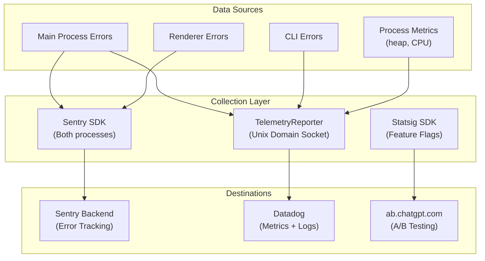
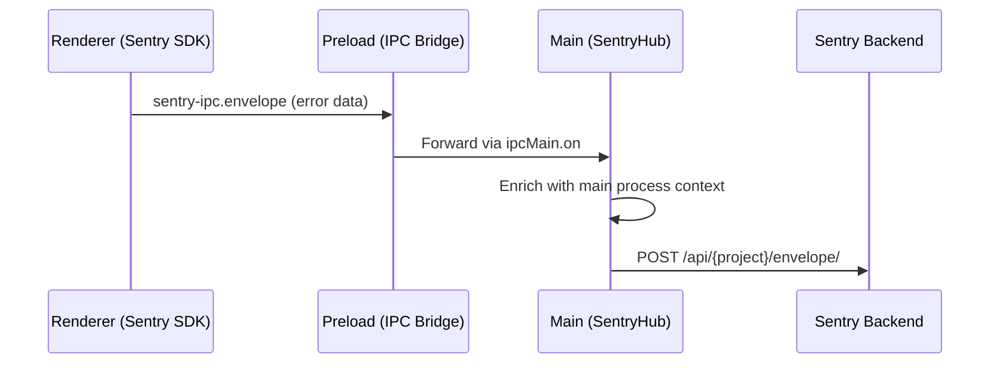
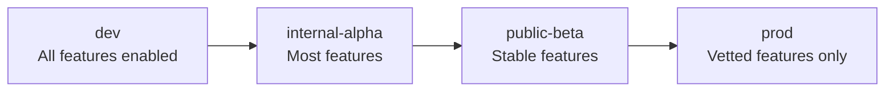

# 15 -- Telemetry & Observability

> The application has a sophisticated observability stack that spans error tracking, structured logging, performance monitoring, and feature flagging. This document covers each system and how they integrate.

---

## Observability Stack

---

## Sentry Integration

### Architecture

The Sentry integration is unusually complex because it must bridge two isolated processes: the main process and the renderer. The implementation includes custom classes:

| Class | Location | Responsibility |
|-------|----------|---------------|
| `SentryClient` | Main | HTTP transport for sending envelopes to Sentry |
| `SentryHub` | Main | Central error collection and routing |
| `SentryScope` | Main | Context and breadcrumb management |
| `SentryTransport` | Main | Envelope serialization and batching |
| `SentrySpan` / `SentryTransaction` | Main | Performance tracing |
| Sentry IPC Bridge | Main | Receives Sentry events from the renderer via IPC |

### Cross-Process Flow

The renderer runs its own Sentry SDK but does not send events directly to the Sentry backend. Instead, events are routed through the main process via the `sentry-ipc.*` channels. The main process enriches them with additional context (user info, session data, build flavor) before forwarding to Sentry.

### DSN and Environment

The Sentry DSN (Data Source Name) is configured per build flavor:

| Build Flavor | Sentry Environment |
|-------------|-------------------|
| `dev` | `development` |
| `internal-alpha` | `alpha` |
| `public-beta` | `beta` |
| `prod` | `production` |

---

## Structured Logging

### TelemetryReporter

The `TelemetryReporter` operates a Unix domain socket-based IPC system:

1. A router process listens on a Unix socket.
2. The `ErrorReporter` connects as a client.
3. Log entries, error events, and metric snapshots are sent as structured JSON messages.
4. The router aggregates and forwards them to Datadog.

### Log Categories

| Category | Content | Frequency |
|----------|---------|-----------|
| Error events | Uncaught exceptions, rejected promises | On occurrence |
| State snapshots | Heap size, thread count, window count | Periodic (every 30s) |
| IPC metrics | Message count, latency distributions | Periodic |
| CLI events | Spawn, exit, error, reconnect | On occurrence |
| Auth events | Login, logout, token refresh | On occurrence |

---

## Feature Flags (Statsig)

### Purpose

Statsig controls feature visibility and A/B testing. The application checks feature gates at runtime to decide whether to enable experimental features, show new UI elements, or route to different API endpoints.

### Build Flavor System

The 4-tier build flavor system provides a separate dimension of feature control:

| Flavor | Audience | Feature Visibility |
|--------|----------|-------------------|
| `dev` | Internal engineers | Everything: debug menus, experimental features, verbose logging |
| `internal-alpha` | Internal testers | New features before public release |
| `public-beta` | Beta testers | Features approaching stability |
| `prod` | All users | Only fully tested, vetted features |

Feature gates in Statsig and flavor checks in code work together. A feature might be gated behind both a Statsig flag (gradual rollout) and a flavor check (never in prod until the gate passes).

### Known Feature Gates

| Gate | Controls |
|------|----------|
| `codex_collab` | Multi-agent collaboration mode |
| `codex_mcp` | MCP server integration |
| `codex_skills` | Skills system |
| `codex_automation` | Automated workflows |
| `codex_inbox` | Notification inbox |
| `codex_enhanced_terminal` | Advanced terminal features |
| `codex_debug_hud` | Debug heads-up display |

---

## Environment Variables for Debugging

| Variable | Effect |
|----------|--------|
| `CODEX_DEBUG=1` | Enables verbose logging throughout the main process |
| `ELECTRON_ENABLE_LOGGING=1` | Enables Chromium's internal logging |
| `RUST_LOG=debug` | Sets Rust CLI log level to debug |
| `CODEX_SENTRY_DISABLED=1` | Disables Sentry error reporting |
| `STATSIG_DISABLED=1` | Disables Statsig feature flags |
| `NODE_ENV=development` | Enables development mode behaviors |

---

## Next Document

Continue to [16 -- Security Model](16-security-model.md) for the application's security architecture.
