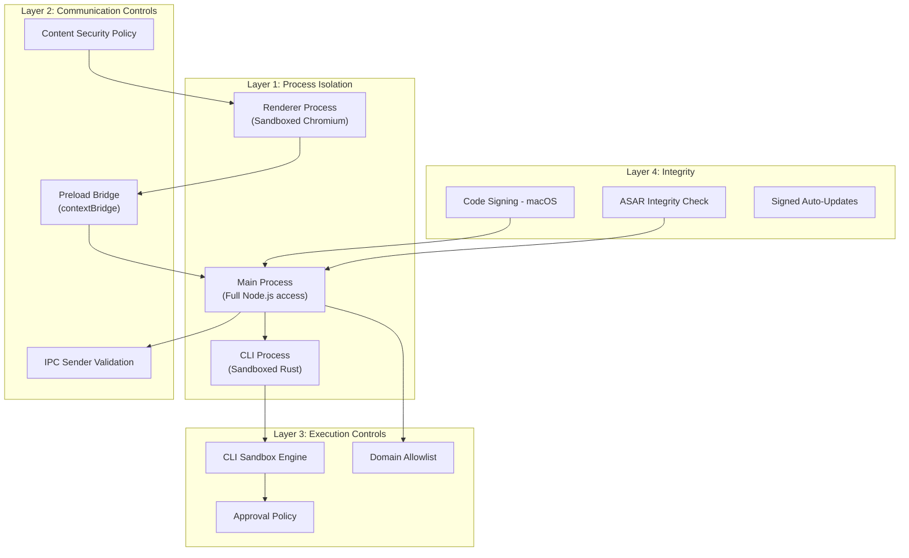
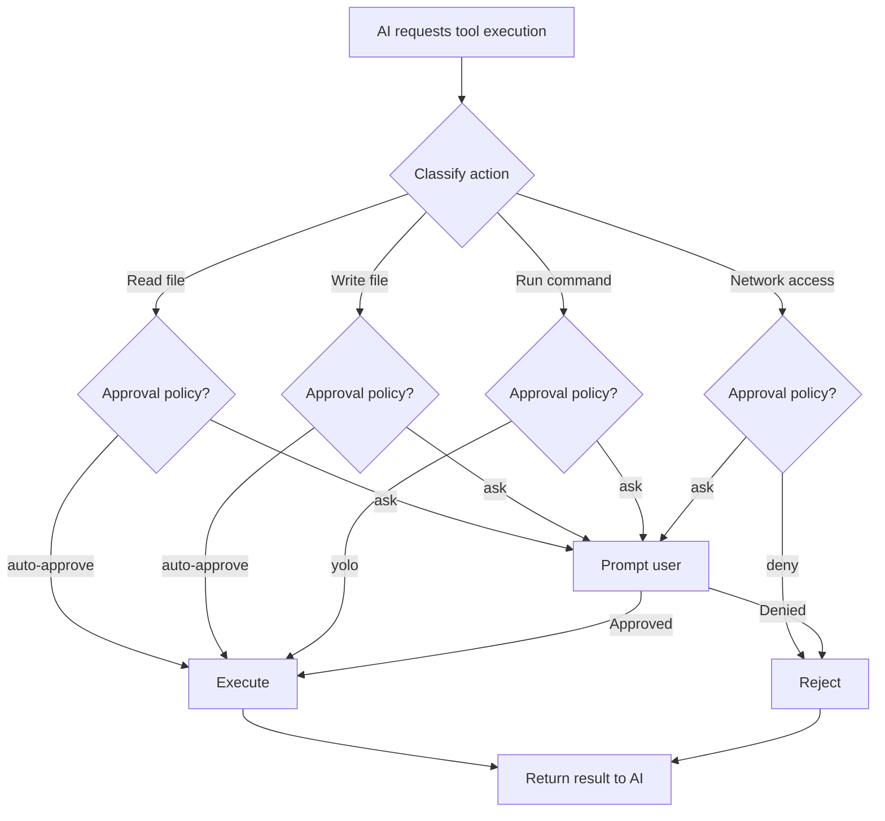

# 16 -- Security Model

> The Codex Desktop Application handles sensitive data -- source code, API keys, authentication tokens -- and has the ability to execute arbitrary commands on the user's machine. The security architecture is designed to contain damage from compromised components.

---

## Defense in Depth



---

## Process Isolation

### Renderer Sandbox

The renderer runs in Chromium's sandbox with these restrictions:

| Restriction | Effect |
|-------------|--------|
| `nodeIntegration: false` | No access to Node.js APIs (fs, child_process, etc.) |
| `contextIsolation: true` | Renderer JavaScript runs in a separate V8 context from the preload |
| `sandbox: true` | Chromium sandbox active -- no direct OS access |
| `webviewTag: false` | Cannot create nested webviews |

A compromised renderer cannot read files, execute commands, or access the network directly. Its only escape path is through the `electronBridge` -- which is validated on the other side.

### Preload Bridge

The preload script runs in a privileged context but only exposes a minimal API surface via `contextBridge.exposeInMainWorld()`. The exposed functions are:

| Function | Purpose | Risk Level |
|----------|---------|------------|
| `sendMessageFromView(msg)` | Send structured messages to main | Medium (validated on receipt) |
| `sendWorkerMessageFromView(type, msg)` | Send messages to worker threads | Low |
| `subscribeToWorkerMessages(type, cb)` | Listen for worker responses | Low |
| `showContextMenu(template)` | Display native context menu | Low |
| `checkForUpdates()` | Trigger update check | Low |
| `getSentryInitOptions()` | Read Sentry config | Low |
| `getBuildFlavor()` | Read build flavor string | Low |

The bridge does not expose `ipcRenderer` directly -- the renderer cannot call arbitrary IPC channels.

---

## IPC Sender Validation

Every `ipcMain.handle()` and `ipcMain.on()` handler calls `validateSender(event)` as its first action. This function:

1. Extracts the `senderFrame` from the IPC event.
2. Checks that the `webContents.id` belongs to a registered BrowserWindow.
3. Verifies the `senderFrame.url` originates from the `app://` scheme.
4. Rejects messages from unknown or untrusted sources.

This prevents rogue iframes, injected scripts, or compromised subframes from calling main process APIs.

---

## Content Security Policy

The renderer operates under a strict CSP injected via the protocol handler:

```
default-src 'none';
script-src 'self' 'wasm-unsafe-eval';
style-src 'self' 'unsafe-inline';
img-src 'self' https: data: blob:;
connect-src 'self' https://ab.chatgpt.com https://cdn.openai.com;
font-src 'self' data:;
worker-src 'self' blob:;
```

Notable restrictions:
- **No `eval()`** -- JavaScript cannot evaluate strings as code.
- **No external scripts** -- Only scripts from the `app://` origin can execute.
- **No arbitrary network** -- Only connections to self, `ab.chatgpt.com`, and `cdn.openai.com` are allowed from the renderer.
- **No inline scripts** -- The `'self'` directive in `script-src` blocks inline `<script>` tags.

---

## CLI Sandbox

The CLI binary implements its own sandbox engine for AI-initiated tool execution:



### Approval Policies

| Policy | Behavior |
|--------|----------|
| `auto-approve` | Executes without asking the user |
| `ask` | Shows the proposed action and waits for user approval |
| `deny` | Always rejects the action |
| `yolo` | Auto-approves everything including destructive commands (CLI flag: `--yolo`) |

The default policy is `ask` for all file writes and command executions. File reads within the workspace are auto-approved. Network access is deny-by-default.

---

## Domain Allowlist for Authentication

The `shouldAttachAuth()` function maintains an allowlist of domains that receive authentication headers:

| Allowed Domain | Purpose |
|----------------|---------|
| `localhost` | Development |
| `localhost:8000` | Local API proxy |
| `openai.com` | OpenAI services |
| `*.openai.com` | OpenAI subdomains |
| `chatgpt.com` | ChatGPT backend |
| `*.chatgpt.com` | ChatGPT subdomains (excluding `ab.chatgpt.com`) |

The exclusion of `ab.chatgpt.com` is intentional -- the A/B testing endpoint does not need authentication tokens, and sending them there would create unnecessary exposure.

---

## ASAR Integrity

Production builds include an `ElectronAsarIntegrity` section in `Info.plist` that contains SHA-256 hashes of the app.asar file. Electron verifies these hashes at startup, preventing tampering with the application code.

In development builds, this check is disabled to allow rapid iteration.

---

## Code Signing

macOS builds are signed with Apple Developer certificates. This provides:

- **Identity verification** -- Users can verify the app comes from OpenAI.
- **Gatekeeper compatibility** -- macOS allows the app to run without security warnings.
- **Hardened runtime** -- Restricts JIT compilation and library injection.

---

## Next Document

Continue to [17 -- Build & Deployment](17-build-deploy.md) for the build system, packaging, and auto-update mechanism.
