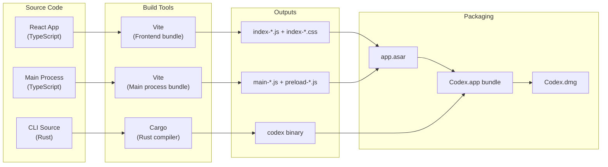
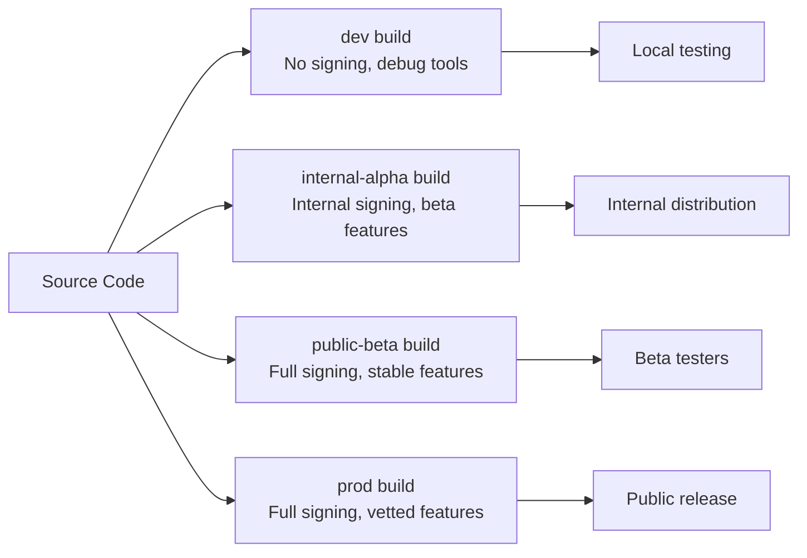
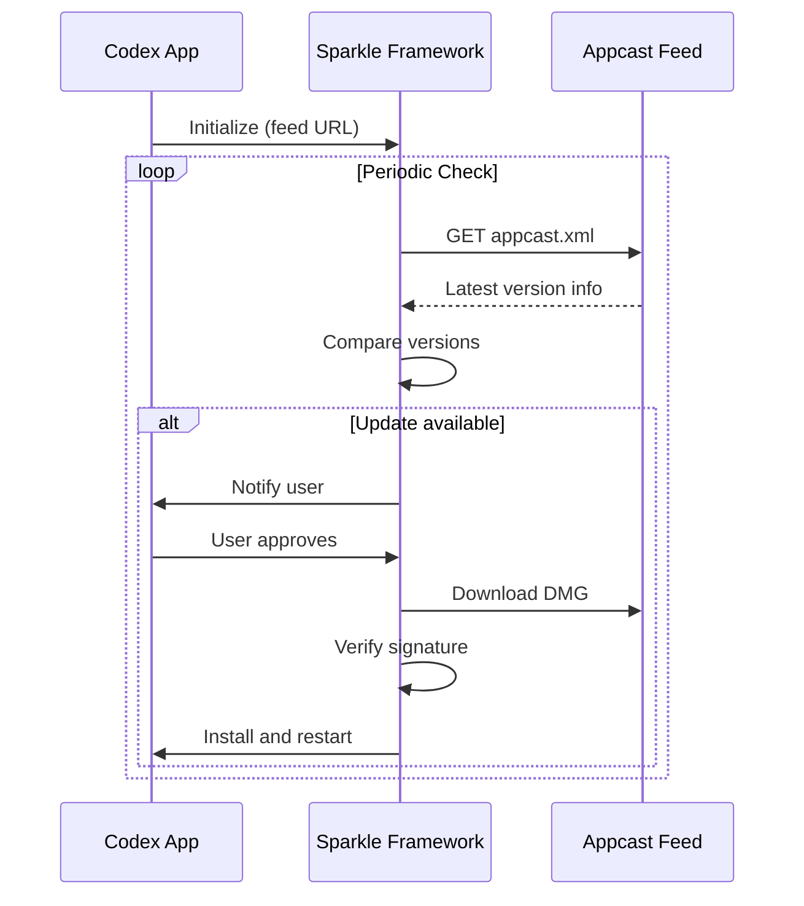

# 17 -- Build & Deployment

> The application is packaged as a macOS .app bundle, distributed as a DMG, and updated via the Sparkle framework. This document covers the build pipeline, packaging strategy, and auto-update mechanism.

---

## Build Pipeline Overview



---

## Vite Build Configuration

The application uses two separate Vite builds:

### Renderer Build

| Setting | Value |
|---------|-------|
| Entry | `src/renderer/index.tsx` |
| Output | `webview/assets/index-{hash}.js`, `webview/assets/index-{hash}.css` |
| Target | `chrome128` (Electron 40's Chromium version) |
| Minification | `terser` |
| Code splitting | Language grammars (Shiki) split into separate chunks |

### Main Process Build

| Setting | Value |
|---------|-------|
| Entry | `src/main/index.ts` |
| Output | `.vite/build/main-{hash}.js`, `.vite/build/preload-{hash}.js` |
| Target | `node22` (Electron 40's Node.js version) |
| External modules | `electron`, `better-sqlite3`, `node-pty` (native addons) |
| Minification | Enabled |

---

## ASAR Archive

The `app.asar` file is an Electron archive that contains all application code except native binaries:

### Contents

| Path inside ASAR | Content |
|-------------------|---------|
| `package.json` | Application metadata, entry point declaration |
| `.vite/build/main-*.js` | Main process bundle |
| `.vite/build/preload-*.js` | Preload script bundle |
| `webview/index.html` | Renderer entry HTML |
| `webview/assets/index-*.js` | React application bundle |
| `webview/assets/index-*.css` | Compiled stylesheet |
| `webview/assets/*.wasm` | WebAssembly modules (Shiki) |
| `webview/assets/custom-*.css` | Custom theme overrides |
| `native/` | Placeholder for native addon references |

### ASAR Unpacked

Some files cannot live inside the ASAR archive because they need direct filesystem access:

| Path | Reason |
|------|--------|
| `app.asar.unpacked/native/sparkle.node` | Native addon loaded via `dlopen` |
| `app.asar.unpacked/native/better_sqlite3.node` | SQLite native addon |
| `app.asar.unpacked/native/pty.node` | PTY native addon |

These files live in `app.asar.unpacked/` adjacent to the ASAR file and are referenced via Electron's automatic ASAR unpacking mechanism.

---

## Application Bundle (macOS)

The `.app` bundle follows the standard macOS structure:

```
Codex.app/
  Contents/
    Info.plist                    # Application metadata
    MacOS/
      Codex                       # Electron executable (renamed from Electron)
    Frameworks/
      Electron Framework.framework/  # Chromium + Node.js runtime
      Sparkle.framework/             # Auto-update framework
      Squirrel.framework/            # Helper for Sparkle
    Resources/
      app.asar                    # Application code archive
      app.asar.unpacked/          # Native addons (direct filesystem access)
      codex                       # Rust CLI binary
      rg                          # ripgrep binary
      app.icns                    # Application icon
```

### Info.plist Configuration

Key entries:

| Key | Value | Purpose |
|-----|-------|---------|
| `CFBundleIdentifier` | `com.openai.codex` | System-wide unique identifier |
| `CFBundleDisplayName` | `Codex` | Name shown in Finder |
| `LSMinimumSystemVersion` | `13.0` | Minimum macOS version (Ventura) |
| `NSAppTransportSecurity` | Allow arbitrary loads | Required for local protocol |
| `ElectronAsarIntegrity` | SHA-256 hash | Tamper detection |

---

## Build Flavors



Each flavor determines:
- Which features are enabled.
- Which Sentry DSN and environment are used.
- Whether debug menus and HUD are available.
- Which auto-update channel to check.
- The application bundle identifier suffix.

---

## Auto-Update (Sparkle)

### Architecture

The Sparkle framework is the standard macOS auto-update mechanism used by many native applications. Codex integrates it via the `sparkle.node` native addon.



### Appcast Feed

The feed URL points to an XML file that lists available versions:

| Field | Content |
|-------|---------|
| `url` | Download URL for the DMG |
| `sparkle:version` | Build number |
| `sparkle:shortVersionString` | Human-readable version |
| `sparkle:dsaSignature` | DSA signature for integrity |
| `sparkle:minimumSystemVersion` | Required macOS version |

### Update Flow

1. Sparkle checks the feed periodically (and on manual trigger from the UI).
2. If a newer version is found, the user is notified.
3. The user can approve, skip, or postpone.
4. On approval, Sparkle downloads the DMG, verifies the signature, extracts the new `.app`, and replaces the current one.
5. The application restarts with the new version.

---

## DMG Packaging

The DMG file is a macOS disk image that provides a drag-and-drop installation experience:

1. The `.app` bundle is placed in a temporary directory.
2. `hdiutil create` creates a read-write DMG from the directory.
3. The DMG is optionally styled with a background image and icon positions.
4. `hdiutil convert` converts the read-write DMG to a compressed read-only DMG.
5. The final DMG is code-signed.

---

## Development Build (Codex-Dev)

The local development build (`Codex-Dev.app`) follows the same structure but with key differences:

| Aspect | Production | Development |
|--------|-----------|-------------|
| Electron source | Bundled in .app | From `node_modules/electron/dist/` |
| CLI binary | Pre-compiled, bundled | Compiled from local Rust source |
| ripgrep binary | Pre-compiled, bundled | Compiled from local Rust source |
| ASAR integrity | SHA-256 verified | Disabled |
| Code signing | Apple Developer cert | None |
| Bundle ID | `com.openai.codex` | `com.openai.codex.dev` |
| User data dir | `~/Library/Application Support/Codex/` | `~/Library/Application Support/Codex-Dev/` |
| Auto-update | Sparkle active | Sparkle disabled |

The `dev-rebuild.sh` script automates the development build:
1. Copies Electron runtime from `node_modules/`.
2. Copies the main process source into the asar source directory.
3. Packs the asar archive.
4. Copies locally compiled CLI and ripgrep binaries.
5. Configures `Info.plist` with development settings.

---

## Next Steps

This concludes the technical documentation for the Codex Desktop Application. Return to the [README](README.md) for the document index, or start from [01 -- Architecture Overview](01-architecture-overview.md) for the big picture.
